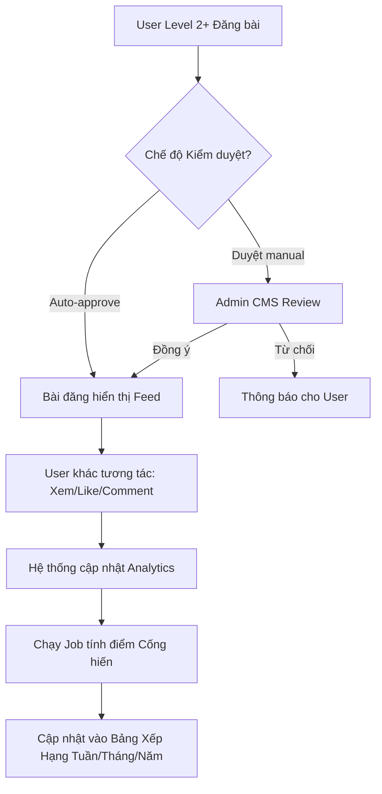

---
{"dg-publish":true,"permalink":"/01-tong-quan-ly-du-an/2-phong-van-hanh/20260409-social-community-spec/","title":"CỘNG ĐỒNG SOCIAL & HỆ THỐNG ĐIỂM CỐNG HIẾN","dg-note-properties":{"title":"CỘNG ĐỒNG SOCIAL & HỆ THỐNG ĐIỂM CỐNG HIẾN"}}
---

# ĐẶC TẢ TÍNH NĂNG
## CỘNG ĐỒNG SOCIAL & HỆ THỐNG ĐIỂM CỐNG HIẾN
**Ứng dụng Chăm Sóc Khách Hàng — Mobile (iOS/Android) & Admin CMS**

**Tên tính năng:** Mạng xã hội nội bộ & Xếp hạng Điểm cống hiến
**Mã tính năng:** FEAT-SOCIAL-GAMIFY
**Phiên bản tài liệu:** v1.0
**Ngày tạo:** 09/04/2026
**Người viết:** AI DSSCLUB
**Đội nhận tài liệu:** Dev Team, Marketing Team
**Trạng thái:** Draft / Review

---

## 1. Tổng Quan
### 1.1 Mô tả tính năng
Xây dựng một không gian "Cộng đồng" ngay trong App DSS Club, nơi người dùng (Kỹ thuật viên, Đại lý) có thể chia sẻ kinh nghiệm, hình ảnh công trình và thảo luận. Để tăng tính tương tác, hệ thống áp dụng cơ chế **Điểm cống hiến** — loại điểm tích lũy dựa trên mức độ phổ biến của bài đăng (Lượt xem, Thích, Bình luận). Điểm này dùng để xếp hạng thành viên theo tuần/tháng/năm và vinh danh những người đóng góp tích cực nhất.

### 1.2 Mục tiêu (Goals)
- Tăng tỷ lệ giữ chân người dùng (Retention Rate) và thời gian sử dụng App (Time spent).
- Xây dựng kho nội dung thực tế từ chính người dùng (User Generated Content) để hỗ trợ đào tạo kỹ thuật chéo.
- Tạo sân chơi công bằng, vinh danh những cá nhân/doanh nghiệp có uy tín và sức ảnh hưởng trong ngành.

### 1.3 Ngoài phạm vi (Non-goals)
⚠️ Tính năng này KHÔNG bao gồm:
- Tính năng nhắn tin tức thời (Chat 1-1).
- Tính năng Livestream (giai đoạn 1).

## 2. Đối Tượng Người Dùng
### 2.1 Vai trò liên quan

| Vai trò | Mô tả | Quyền thực hiện |
|---------|-------|-----------------|
| Thành viên (Level 1) | Người dùng mới | Xem bài viết, Bình luận ẩn danh (Nickname đen). Không được đăng bài hoặc tích điểm. |
| Thành viên (Level 2+) | KTV/Đại lý đã xác thực | Đăng bài (Ảnh/Video), Tương tác, Tích lũy điểm cống hiến, Hiển thị Tích xanh. |
| Admin / Moderator | Ban quản trị DSS | Cấu hình tham số tính điểm, phê duyệt nội dung, quản lý bảng xếp hạng. |

### 2.2 User Stories
- [US-01] Là KTV, tôi muốn chia sẻ ảnh "Giải pháp lắp đặt camera khó" của mình để anh em khác tham khảo và tích lũy điểm cống hiến để lên Top bảng xếp hạng tháng.
- [US-02] Là người dùng, tôi muốn xem các bài viết Hot nhất trong tuần để cập nhật mẹo kỹ thuật mới từ những người có thứ hạng cao.
- [US-03] Là Admin, tôi muốn có thể điều chỉnh công thức tính điểm (ví dụ: tăng trọng số cho Lượt xem) khi có chiến dịch Marketing đặc biệt.

## 3. Yêu Cầu Chức Năng (Hệ thống có thể cài đặt - Configurable)

| Mã | Mô tả yêu cầu | Độ ưu tiên | Ghi chú |
|----|---------------|------------|---------|
| FR-01 | **Bảng tin (Community Feed):** Hiển thị danh sách bài đăng theo thời gian thực hoặc theo thuật toán "Hot" (dựa trên tương tác). Hỗ trợ định dạng Text, Image (Up to 9), Video. | Cao | |
| FR-02 | **Quyền Đăng bài (Posting Permission):** Admin có thể cài đặt Level tối thiểu để được đăng bài (Mặc định: Level 2). | Cao | Configurable |
| FR-03 | **Tương tác:** Cho phép Thích (Like), Bình luận (Comment), Chia sẻ (Share) và theo dõi Lượt xem (View count). | Cao | |
| FR-04 | **Hệ thống Điểm cống hiến:** Tự động cộng điểm cho Chủ bài đăng dựa trên tương tác. Công thức tính điểm phải cho phép Admin thay đổi hệ số nhân (Multipliers) trên CMS. | Cao | Configurable |
| FR-05 | **Bảng xếp hạng (Leaderboard):** Hiển thị Top 10/50 người có điểm cống hiến cao nhất theo 3 mốc: Tuần, Tháng, Năm. | Cao | |
| FR-06 | **Admin - Cơ chế kiểm duyệt:** Cho phép chuyển đổi giữa 3 chế độ: 1. Đăng ngay (Auto), 2. Duyệt trước khi đăng (Manual), 3. Chỉ duyệt bài có từ khóa nhạy cảm. | Cao | Configurable |
| FR-07 | **Huy hiệu Vinh danh:** Tự động gắn huy hiệu "Top Tuần", "Chuyên gia" dựa trên thứ hạng cho Profile user. | Trung bình | |

## 4. Đặc tả logic Điểm Cống Hiến (Chi tiết cài đặt)
Hệ thống tính điểm dựa trên sự kiện (Event-based calculation).

### 4.1 Công thức mặc định
`Tổng điểm = (Lượt xem * A) + (Lượt thích * B) + (Bình luận * C) + (Bài đăng * D)`
- **A (Hệ số View):** 0.1 điểm / View.
- **B (Hệ số Like):** 1 điểm / Like.
- **C (Hệ số Comment):** 2 điểm / Comment (Chỉ tính comment từ các User khác nhau).
- **D (Hệ số Post):** 5 điểm / Bài đăng được duyệt.

### 4.2 Cấu hình chống gian lận (Anti-Spam)
- Giới hạn điểm tích lũy tối đa từ 1 bài đăng (E.g: Max 500 điểm/bài).
- Giới hạn điểm tích lũy tối đa mỗi ngày cho 1 User (E.g: Max 200 điểm/ngày).
- Chỉ tính View từ User duy nhất (Unique View) trong vòng 24h.

## 5. Luồng Xử Lý (Flowchart)

### 5.1 Luồng Đăng bài & Tích điểm

## 6. Xử Lý Lỗi & Trường Hợp Ngoại Lệ

| Tình huống lỗi | Thông báo hiển thị | Hành động tiếp theo |
|----------------|--------------------|---------------------|
| User Level 1 cố tình đăng bài | "Yêu cầu định danh Level 2 để được tham gia đóng góp cộng đồng." | Chuyển hướng sang trang eKYC |
| Nội dung chứa từ khóa cấm | "Bài viết chứa nội dung không phù hợp và đã bị chuyển đến bộ phận kiểm duyệt." | Đẩy bài vào trạng thái Chờ duyệt (Pending Review) |
| Lỗi mạng khi upload Video nặng | "Kết nối không ổn định. Đang thử lại..." | Resume upload hoặc báo lỗi sau 3 lần thử. |

## 7. Tiêu Chí Chấp Nhận (Acceptance Criteria)
✅ Tính năng đạt khi:
- [AC-01] Admin có thể thay đổi hệ số nhân (A, B, C, D) trên CMS và điểm bắt đầu được tính theo hệ số mới ngay lập tức cho các tương tác sau đó.
- [AC-02] Bảng xếp hạng Tuần phải tự động reset vào 00:00 sáng Thứ Hai hàng tuần.
- [AC-03] Người dùng đạt Top 3 Bảng xếp hạng tháng phải nhận được thông báo Push vinh danh.
- [AC-04] Hệ thống không tính điểm cho những tương tác tự Like/Comment bởi chính chủ bài đăng.
- [AC-05] Màn hình CMS hiển thị đầy đủ danh sách bài đăng chờ duyệt với ảnh/video rõ nét.

## 8. Phụ Thuộc & Rủi Ro
### 8.1 Phụ thuộc
- Hạ tầng lưu trữ Video/Ảnh (S3 hoặc CDN) để đảm bảo tốc độ load Feed.
- Background Job (Worker) để xử lý việc tính toán điểm số cho hàng ngàn tương tác mỗi ngày mà không làm treo Server.

### 8.2 Rủi ro
- **Point Farming:** Nhóm người dùng ảo tương tác chéo để lấy điểm. **Giải pháp:** Áp dụng thuật toán Unique IP/Device và giới hạn trần (Limit Caps) mỗi bài đăng.
- **Nội dung độc hại:** **Giải pháp:** Tích hợp bộ lọc từ khóa nhạy cảm tự động và nút "Báo cáo bài viết" cho cộng đồng.

## 9. Lịch Sử Thay Đổi

| Phiên bản | Ngày | Người thực hiện | Nội dung thay đổi |
|-----------|------|-----------------|-------------------|
| v1.0 | 09/04/2026 | AI DSSCLUB | Khởi tạo tài liệu dựa trên yêu cầu của User về Community Feed & Gamification. |
