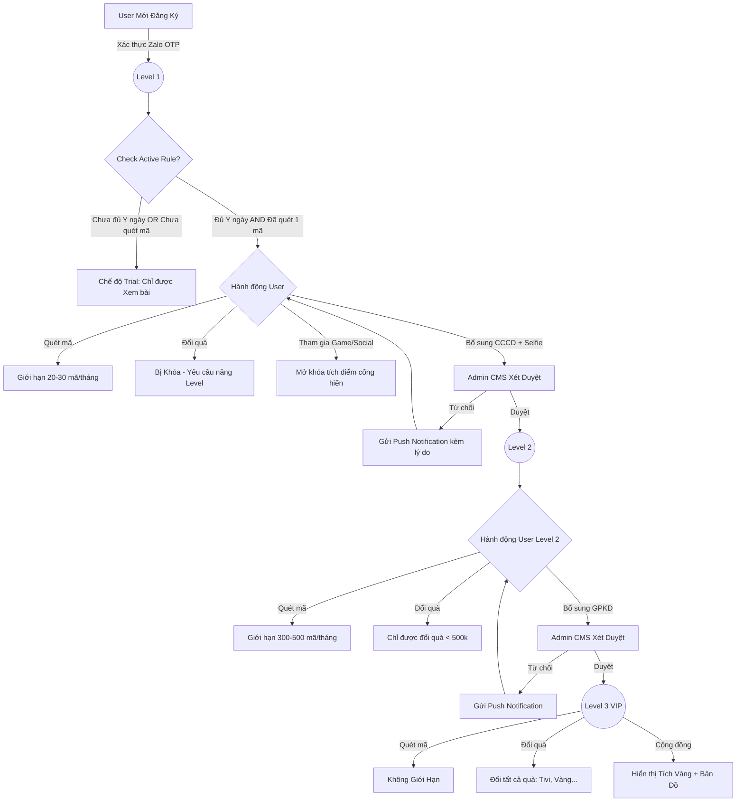

---
{"dg-publish":true,"permalink":"/01-tong-quan-ly-du-an/2-phong-van-hanh/20260409-verification-levels-proposal/","title":"PHÂN CẤP ĐẶC QUYỀN TÀI KHOẢN (VERIFICATION LEVELS)","dg-note-properties":{"title":"PHÂN CẤP ĐẶC QUYỀN TÀI KHOẢN (VERIFICATION LEVELS)"}}
---

# ĐẶC TẢ TÍNH NĂNG
## HỆ THỐNG PHÂN CẤP ĐẶC QUYỀN TÀI KHOẢN (VERIFICATION LEVELS)
**Ứng dụng Chăm Sóc Khách Hàng — Mobile/Web/App/CMS**

**Tên tính năng:** Phân cấp đặc quyền (Level 1-2-3) theo mức độ xác thực
**Mã tính năng:** FEAT-VERIF-LVL
**Phiên bản tài liệu:** v1.0
**Ngày tạo:** 09/04/2026
**Người viết:** Lập trình viên AI / Theo ảnh mô tả
**Đội nhận tài liệu:** Dev Team
**Trạng thái:** Draft

---

## 1. Tổng Quan
### 1.1 Mô tả tính năng
Tính năng "Phân Cấp Đặc Quyền" cho phép hệ thống chia người dùng thành 3 cấp độ (Level 1: Cơ bản, Level 2: Thợ tự do, Level 3: Doanh nghiệp VIP) dựa trên mức độ hoàn thiện hồ sơ định danh cá nhân/doanh nghiệp. Thông qua các mốc Level, hệ thống áp dụng các giới hạn khác nhau về: số lượng mã quét mỗi tháng, quyền đổi quà, quyền tham gia sự kiện và huy hiệu vinh danh trong cộng đồng.

### 1.2 Mục tiêu (Goals)
- Kiểm soát và giới hạn quyền lợi của những tài khoản chưa định danh rõ ràng, giảm thiểu trục lợi và lừa đảo.
- Thúc đẩy người dùng upload hồ sơ eKYC (CCCD/Selfie) và giấy tờ kinh doanh để được nâng cấp quyền lợi.
- Tạo ra sự khác biệt về đặc quyền cho nhóm Doanh nghiệp VIP nhằm tri ân khách hàng thân thiết.

### 1.3 Ngoài phạm vi (Non-goals)
⚠️ Tính năng này KHÔNG bao gồm:
- Quy trình OCR bóc tách giấy tờ tự động (Giấy phép kinh doanh có thể cần admin duyệt thủ công bằng mắt ở giai đoạn 1).

## 2. Đối Tượng Người Dùng
### 2.1 Vai trò liên quan

| Vai trò | Mô tả | Quyền thực hiện |
|---------|-------|-----------------|
| Người dùng (KTV/Đại lý) | Là người sử dụng app cần được phân quyền | Nộp hồ sơ xét duyệt nâng Level, khai thác các đặc quyền theo giới hạn Level hiện có. |
| Admin / CSKH | Quản trị dự án từ phía DSS | Tiếp nhận, kiểm tra tính hợp lệ của CCCD/Giấy phép và duyệt thăng hạng Level cho người dùng. |

### 2.2 User Stories
- [US-01] Là người dùng mới (Level 1), tôi muốn thấy sự giới hạn của tài khoản mình (không được đổi hiện vật) để tôi có động lực định danh lên Level 2.
- [US-02] Là Thợ lắp đặt (Level 2), tôi muốn được hệ thống ghi nhận Tích Xanh để anh em trong cộng đồng tin tưởng, đồng thời tôi muốn được phép đổi các quà tặng giá trị <500K.
- [US-03] Là Đại lý lớn (Level 3), tôi muốn tài khoản của mình không bị khoá giới hạn quét mã (Uncapped) và có quyền đổi bất cứ món quà đắt tiền nào trong kho với Tích Vàng danh giá hiển thị trên bản đồ.
- [US-04] Là Admin hệ thống, tôi muốn có bảng cấu hình Bật/Tắt module xác thực và thiết lập Threshold cho tính năng đổi quà.
- [US-05] Là Admin hệ thống, tôi muốn có giao diện quản lý phê duyệt hồ sơ trực quan cùng ảnh chụp Upload của User để tôi đối chiếu và nhấn Duyệt/Từ chối.
- [US-06] Là Admin hệ thống, tôi muốn thiết lập điều kiện "Kích hoạt tài khoản người dùng thực" (số ngày tối thiểu + ít nhất 1 mã quét) để ngăn chặn nick rác tham gia Minigame/Kiếm điểm.
- [US-07] Là Admin/CSKH, tôi muốn thu thập Họ và tên thật của các tài khoản Level 2/3 để phục vụ công tác giao quà tặng vật lý, in thẻ sự kiện và quản lý Check-in Workshop.

## 3. Yêu Cầu Chức Năng

| Mã | Mô tả yêu cầu | Độ ưu tiên | Ghi chú |
|----|---------------|------------|---------|
| FR-01 | **Level 1 (Mặc định):** Kích hoạt vào tài khoản ngay khi xác thực Zalo/SĐT thành công. Giới hạn quét tối đa 20 - 30 mã/tháng. BẮT BUỘC khoá chức năng đổi quà bằng điểm (chỉ được chơi Minigame). Tên nickname hiển thị màu đen, bình luận ẩn danh. | Cao | Mốc giới hạn mã có thể cấu hình ở CMS. |
| FR-02 | **Luồng Cập Nhật Level 2:** Yêu cầu người dùng upload 2 mặt CCCD, Ảnh selfie khuôn mặt, Ảnh chỗ ở/cửa hàng. **Bổ sung trường Nhập liệu: Họ và tên thật** (đối chiếu với CCCD). | Cao | Chờ CMS admin Approve |
| FR-03 | **Level 2 (KTV/Thợ):** Hạn mức quét nới lỏng thành 300 - 500 mã/tháng. Mở khoá đổi quà nhỏ & vừa (Voucher < 500k, áo, nón...). Tên nickname có dấu Tích Xanh (Verified). Tham gia các sự kiện Vòng Quay tầm trung. | Cao | |
| FR-04 | **Luồng Cập Nhật Level 3:** Yêu cầu người dùng đang ở Level 2 tiếp tục upload Giấy Phép Kinh Doanh. | Cao | Chờ CMS admin Approve |
| FR-05 | **Level 3 (Doanh nghiệp VIP):** Bỏ hoàn toàn giới hạn quét (Không giới hạn mã). Mở khoá TẤT CẢ sản phẩm đổi quà (Tivi, Ô tô, Vàng miếng). Nhận Vé đặc quyền tham gia sự kiện Siêu Khuyến Mãi lớn nhất năm. | Cao | |
| FR-06 | **Hiển thị Cộng Đồng (Level 3):** Tên chữ màu Vàng + Tích Vàng. Kích hoạt tính năng ưu tiên đưa lên bản đồ "Anh em quanh đây" để khách hàng dễ dàng tìm đến mua hàng. | Trung bình | Yêu cầu toạ độ (Location) từ app. |
| FR-07 | **Luồng cảnh báo Limit:** Khi người chơi đạt mốc mã quét hoặc nhấn vào nút "Đổi quà" vượt Level, hệ thống chặn lại và bung Pop-up gọi ý "Nâng cấp lên Level X để trải nghiệm tính năng này". | Cao | UI sinh động, Call to Action rõ ràng. |
| FR-08 | **Admin - Cấu hình điều kiện (Settings):** CMS cung cấp UI cho phép bật/tắt yêu cầu xác thực độc lập cho từng module (Ví dụ: Tắt bắt buộc xác thực với Quét mã, nhưng Bật đối với module Đổi quà). | Cao | Bảng Cấu hình tổng |
| FR-09 | **Admin - Cấu hình Ngưỡng (Threshold):** Trong Settings module Đổi quà, cho phép Admin nhập tham số giới hạn (Vd: [X] điểm). Tài khoản chưa xác thực (Level 1) chỉ được đổi các quà có giá trị < [X]. | Cao | Biến cấu hình linh hoạt |
| FR-10 | **Admin - Quản lý phê duyệt (Approval Workflow):** Có màn hình List danh sách hồ sơ đệ trình của user đang chờ duyệt. Giao diện xem chi tiết hiển thị trực quan Ảnh User đã upload để đối chiếu song song với thông tin text. | Cao | UI đối chiếu dễ thao tác |
| FR-11 | **Admin - Thao tác Duyệt/Từ chối:** Admin nhấn 'Duyệt' => Hệ thống Update Level hội viên. Nhấn 'Từ chối' => Bắt buộc nhập quy định lý do lỗi => Bắn Push notification về App cho User kèm lý do xử lý. | Cao | Realtime Status Sync |
| FR-12 | **Cơ chế Kích hoạt Tài khoản (Active Rule):** Hệ thống chỉ mở khóa quyền tham gia Minigame, Vòng quay, và kiếm Điểm cống hiến cho tài khoản thỏa mãn: Đã đăng ký đủ [Y] ngày VÀ có ít nhất 01 mã quét sản phẩm thành công. | Cao | Admin cấu hình được [Y] |
| FR-13 | **Admin - Cấu hình Kích hoạt Tài khoản:** CMS cung cấp ô nhập số ngày cấu hình [Y] (Tenure threshold). Thay đổi này áp dụng ngay lập tức cho các tài khoản mới đăng ký sau đó. | Trung bình | Cấu hình tham số hệ thống |
| FR-14 | **Đồng bộ thông tin sự kiện/Giao hàng:** Thông tin "Họ và tên thật" sau khi Admin duyệt sẽ được trích xuất tự động vào các module: In phiếu giao hàng (Shipping labels), Danh sách khách mời Workshop và mã QR Check-in sự kiện. | Cao | |
## 4. Yêu Cầu Phi Chức Năng
### 4.1 Hiệu năng
- API kiểm tra và đối chiếu quyền (Limit quét mã, Limit kho quà) phải trả kết quả tức thời (dưới 300ms) để luồng sử dụng của App không bị gián đoạn.

### 4.2 Bảo mật
- Mọi hình ảnh cá nhân (CCCD, Selfie) phải được mã hoá liên kết đường dẫn trên S3 bucket, chống lộ lọt ra môi trường internet ngoài hệ thống CMS.

### 4.3 Khả dụng
- Ứng dụng app cung cấp trải nghiệm chụp hình giấy tờ nhanh nhạy, tự crop khung viền nếu có thể để hỗ trợ thao tác KTV tại công trình.

## 5. Luồng Xử Lý (Happy Path)

### 5.1 Sơ đồ luồng (Flowchart)

### 5.2 Các bước chi tiết

| # | Tác nhân | Hành động | Kết quả / Điều kiện |
|---|----------|-----------|---------------------|
| 1 | Người dùng Level 1 | Ấn vào một phần quà là "Voucher 200K" | Hệ thống hiện Popup: "Quà này dành cho Level 2 trở lên. Hãy bổ sung hồ sơ." |
| 2 | Người dùng | Nhấn nút "Bổ sung hồ sơ ngay". Chụp CCCD 2 mặt, chụp Selfie, chụp Cửa hàng và Bấm Nộp | Trạng thái Profile = Đang chờ duyệt Level 2 |
| 3 | Admin (CMS) | Thấy Record yêu cầu trong Admin Panel, kiểm tra ảnh rõ nét và bấm nút "Approve" | Cấp độ user chuyển thành Level 2 trong Database |
| 4 | Hệ thống | Trả về notification tới App báo tin vui cho khách | Chức năng quét mã được cập nhật threshold là 500 mã; các quà dưới 500k bị ungrey (sáng lên cho phép đổi); hiển thị tích xanh. |
| 5 | Người dùng Level 2 | Nộp thêm Giấy Phép Kinh Doanh | Admin duyệt tương tự -> User trở thành Level 3 VIP. |

## 6. Xử Lý Lỗi & Trường Hợp Ngoại Lệ

| Tình huống lỗi | Thông báo hiển thị | Hành động tiếp theo |
|----------------|--------------------|---------------------|
| Đạt hạn mức mã quét tối đa của Level 1 / Level 2 | "Bạn đã quét được [XX] mã, đạt mức tối đa của [Level X] tháng này. Nâng cấp ngay để không bỏ lỡ điểm thưởng!" | Chuyển hướng tới trang bổ sung Hồ sơ định danh |
| Ảnh CCCD hoặc Selfie bị mờ nhòe | "Hình ảnh không rõ ràng. Vui lòng chụp tại nơi có ánh sáng tốt và đảm bảo không loá mờ." | Cho phép user chụp lại từ App, không lưu ảnh lỗi về server |
| Admin từ chối do Giấy phép rách/sai thông tin | Không có thông báo trực tiếp mà Admin sẽ tick chọn lý do từ chối trên CMS -> System trả về Push Notification | Báo người dùng chuẩn bị hồ sơ hợp lệ tải lên lại. |

## 7. Tiêu Chí Chấp Nhận (Acceptance Criteria)
✅ Tính năng đạt khi:
- [AC-01] Hệ thống cấm triệt để tài khoản Level 1 không được redeem (đổi vật phẩm) bằng điểm, mà chỉ được chơi Minigame.
- [AC-02] Mọi tài khoản Level 2 đều bị cản lại khi chọn đổi Vàng miếng / Ô tô (các quà siêu VIP).
- [AC-03] Tính block limit (20-30 mã cho lv1, 300-500 mã cho lv2) reset chính xác vào lúc 0:00:00 ngày đầu tiên của tháng mới.
- [AC-04] Dấu Tích Xanh và Tích Vàng hiển thị chuẩn xác ở mọi nơi trên giao diện App (Leaderboard, Bình luận, Profile, Bản đồ cộng đồng).
- [AC-05] User Level 3 xuất hiện trên feature "Anh em quanh đây" của các User xung quanh thành công.
- [AC-06] Tại CMS, Admin có thể toggle Bật/Tắt cờ xác thực cho từng module (Quét mã/Đổi quà) và nhập động tham số biến Threshold [X] điểm thành công. Thay đổi có hiệu lực ngay lập tức.
- [AC-07] Thao tác "Từ chối" trên màn hình Approval Workflow của Admin bắt buộc phải có bước nhập/chọn lý do từ chối. Push Notification chứa đúng nội dung lý do đó phải nổ ra trên máy khách của người dùng.
- [AC-08] Tài khoản chưa đủ điều kiện Kích hoạt (Active Rule) khi nhấn vào Minigame hoặc mục Cộng Đồng phải hiển thị thông báo popup: "Bạn cần tham gia đủ [Y] ngày và quét ít nhất 1 mã để mở khóa tính năng này".
- [AC-09] Tại CMS, Admin thay đổi giá trị [Y] và nhấn Lưu, hệ thống phải áp dụng logic kiểm tra tức thì cho toàn bộ người dùng chưa kích hoạt.
- [AC-10] Hệ thống chỉ hiển thị dấu Tích Xanh kèm "Họ và tên thật" trên trang cá nhân của các tài khoản đã vượt qua phê duyệt Level 2.
- [AC-11] Tại module CSKH/Quà tặng, khi Admin chọn "Xuất phiếu giao hàng", hệ thống phải lấy đúng "Họ và tên thật" đã được xác minh (thay vì các nickname/Zalo name tự đặt).
## 8. Phụ Thuộc & Rủi Ro
### 8.1 Phụ thuộc
- Team Marketing và Vận Hành cần quyết định chính xác con số cứng cho giới hạn mức quét và giá trị quà trước khi code.
- Tính năng bản đồ "Anh em quanh đây" phụ thuộc vào việc client thiết bị phải cấp quyền truy cập định vị GPS.

### 8.2 Rủi ro
- Việc khóa quyền đột ngột với những user đang dùng App như bình thường có thể tạo một đợt review phẫn nộ từ khách hàng. **Giải pháp:** Cần có chuỗi thông báo truyền thông và popup cảnh báo 2 tuần trước khi áp dụng cơ chế block thực tế vào sản phẩm.

## 9. Lịch Sự Thay Đổi

| Phiên bản | Ngày | Người thực hiện | Nội dung thay đổi |
|-----------|------|-----------------|-------------------|
| v1.0 | 09/04/2026 | AI DSSCLUB | Áp dụng SKILL và biên soạn dựa trên Table Bảng Phân Cấp Đặc Quyền Tài Khoản do người dùng cung cấp. |
