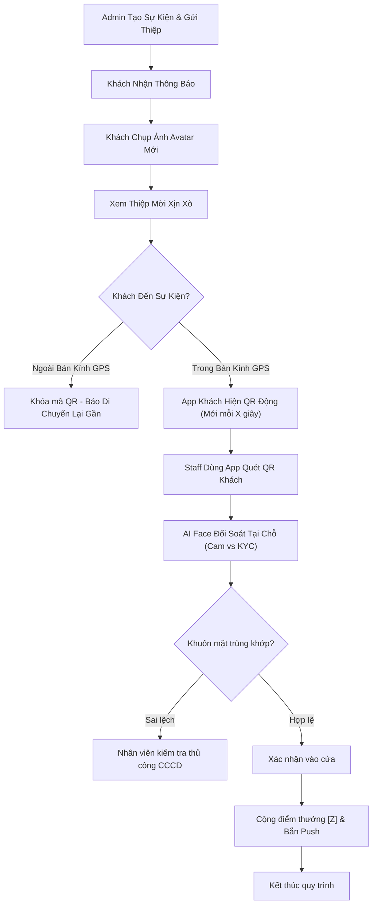

---
{"dg-publish":true,"permalink":"/01-tong-quan-ly-du-an/2-phong-van-hanh/20260410-event-checkin-spec/","title":"HỆ THỐNG CHECK-IN SỰ KIỆN (AI FACE & DYNAMIC QR)","dg-note-properties":{"title":"HỆ THỐNG CHECK-IN SỰ KIỆN (AI FACE & DYNAMIC QR)"}}
---

# ĐẶC TẢ TÍNH NĂNG
## HỆ THỐNG CHECK-IN SỰ KIỆN (AI FACE & DYNAMIC QR)
**Ứng dụng Chăm Sóc Khách Hàng — Mobile (User), Staff App & Admin CMS**

**Tên tính năng:** Check-in sự kiện thông minh (AI Face & Dynamic QR)
**Mã tính năng:** FEAT-EVENT-CHECKIN
**Phiên bản tài liệu:** v1.0
**Ngày tạo:** 10/04/2026
**Người viết:** AI DSSCLUB
**Đội nhận tài liệu:** Dev Team, Infrastructure Team, Operation Team
**Trạng thái:** Draft / Review

---

## 1. Tổng Quan
### 1.1 Mô tả tính năng
Xây dựng quy trình Check-in sự kiện (Workshop, Hội nghị khách hàng) khép kín, bảo mật và chuyên nghiệp. Tính năng cho phép tự động hóa việc xác thực danh tính khách mời bằng sự kết hợp giữa **Mã QR Động** (chống gian lận ảnh chụp), **Định vị GPS** (đảm bảo khách có mặt tại điểm tập kết) và **AI Face Recognition** (đối soát khuôn mặt khách với dữ liệu xác minh KYC).

### 1.2 Mục tiêu (Goals)
- Loại bỏ hoàn toàn tình trạng check-in hộ hoặc sử dụng thẻ mời giả.
- Rút ngắn thời gian đón khách, tăng tính trải nghiệm công nghệ tại sự kiện.
- Tự động hóa việc cộng điểm thưởng cho khách tham dự đúng giờ.
- Thu thập dữ liệu check-in thời gian thực phục vụ báo cáo và in thẻ đeo tại chỗ.

## 2. Đối Tượng Người Dùng
### 2.1 Vai trò liên quan

| Vai trò | Mô tả | Quyền thực hiện |
|---------|-------|-----------------|
| Khách mời (User) | Người dùng app (thường là Level 2+) | Chụp ảnh Avatar sự kiện, nhận thiệp mời, xuất mã QR để check-in. |
| Nhân viên cửa (Staff) | Nhân viên DSS trực tại quầy check-in | Sử dụng Staff App quét mã của khách, xác nhận khuôn mặt trùng khớp. |
| Admin (Manager) | Quản trị viên sự kiện trên CMS | Tạo sự kiện, cấu hình tọa độ, điểm thưởng, thời gian làm mới QR. |

### 2.2 User Stories
- [US-01] Là khách mời, tôi muốn nhận được thiệp mời điện tử có in hình mình vừa chụp để cảm thấy được trân trọng và thể hiện tính cá nhân hóa.
- [US-02] Là nhân viên check-in, tôi muốn khi quét mã của khách, hệ thống phải báo ngay khuôn mặt khách có đúng với ảnh đã xác minh (KYC) không để tôi cho phép họ vào cửa.
- [US-03] Là Admin, tôi muốn quy định mã QR của khách cứ 30 giây phải đổi một lần để tránh việc khách chụp ảnh màn hình gửi cho đồng nghiệp check-in thay.

## 3. Yêu Cầu Chức Năng (Hệ thống có thể cài đặt - Configurable)

### 3.1 Đối với Người dùng (Guest App)
| Mã | Mô tả yêu cầu | Độ ưu tiên | Ghi chú |
|----|---------------|------------|---------|
| FR-01 | **Thông báo sự kiện:** Gửi Push Notification và Inbox cho user khi có thiệp mời mới. | Cao | |
| FR-02 | **Cung cấp Avatar sự kiện:** Yêu cầu user chụp một tấm hình chân dung mới để làm Avatar trên thiệp mời điện tử. | Cao | Chụp trực tiếp từ Cam |
| FR-03 | **Xem Thiệp mời (Invitation Preview):** Render thiệp mời điện tử đẹp mắt (Template do Admin cung cấp), hiển thị Tên, Avatar vừa chụp và tọa độ sự kiện. | Cao | In-app view |
| FR-04 | **Mã QR Động:** Hiển thị mã QR duy nhất cho mỗi user. Mã này tự động làm mới sau [X] giây dựa trên thuật toán TOTP. | Cao | Configurable [X] |
| FR-05 | **Rào cản GPS (Geofencing):** Mã QR chỉ hiển thị khi tọa độ khách hàng nằm trong bán kính [R] mét quanh tọa độ sự kiện. Nếu ngoài bán kính, hiển thị thông báo: "Vui lòng di chuyển đến khu vực sự kiện để nhận mã check-in". | Cao | Configurable [R] |

### 3.2 Đối với Nhân viên (Staff App)
| Mã | Mô tả yêu cầu | Độ ưu tiên | Ghi chú |
|----|---------------|------------|---------|
| FR-06 | **Quét mã (Scan Mode):** Sử dụng camera máy tính bảng/điện thoại quét mã QR động của khách. | Cao | Tốc độ quét < 500ms |
| FR-07 | **Đối soát Face AI:** Hệ thống tự động gọi API nhận diện khuôn mặt (từ camera tablet tại cửa) so sánh với Ảnh KYC (Level 2) của tài khoản vừa quét QR. | Cao | Hiển thị % trùng khớp |
| FR-08 | **Xác nhận Check-in:** Hiển thị thông tin khách (Tên thật, Công ty), Avatar sự kiện và kết quả Face AI. Nhân viên bấm "Xác nhận" để hoàn tất. | Cao | |

### 3.3 Đối với Quản trị viên (Admin CMS)
| Mã | Mô tả yêu cầu | Độ ưu tiên | Ghi chú |
|----|---------------|------------|---------|
| FR-09 | **Cấu hình tham số sự kiện:** Tạo sự kiện mới, thiết lập tọa độ GPS (Kinh độ/Vĩ độ), bán kính [R], điểm thưởng [Z]. | Cao | |
| FR-10 | **Cấu hình QR TTL:** Ô nhập số giây [X] để mã QR tự làm mới (Mặc định 30s). | Trung bình | |
| FR-11 | **Báo cáo Real-time:** Dashboard hiển thị tổng số khách được mời, số khách đã vào cửa, biểu đồ thời gian khách đến nhiều nhất. | Cao | |

## 4. Đặc tả Logic Kỹ Thuật

### 4.1 Cơ chế QR Động (TOTP)
Hệ thống sử dụng một chuỗi Secret Key duy nhất kết hợp với Timestep hệ thống để tạo mã QR. 
- **Công thức:** `QR_Payload = UserID + EventID + TOTP(Secret, Timestamp, TTL)`.
- **TTL (Time-To-Live):** Cấu hình linh hoạt từ 15s - 300s.

### 4.2 Logic Đối soát Khuôn mặt (Face AI)
- **Reference Image:** Ảnh xác minh danh tính (KYC Level 2) trong Database.
- **Probe Image:** Ảnh lấy trực tiếp từ Camera tại quầy check-in của Staff.
- **Display Result:** Trả về tỷ lệ % Matching. Nếu > 80% (Configurable), hệ thống tự động tích xanh báo "Hợp lệ".

### 4.3 Điểm thưởng (Reward Points)
- Sau khi Staff bấm "Xác nhận", hệ thống gọi Task cộng điểm [Z] vào quỹ điểm của User.
- Bắn Push Notification báo: "Chúc mừng bạn đã nhận được [Z] điểm cống hiến khi tham dự sự kiện [Tên sự kiện]".

## 5. Luồng Xử Lý (Flowchart)

## 6. Xử Lý Lỗi & Trường Hợp Ngoại Lệ

| Tình huống lỗi | Thông báo hiển thị | Hành động tiếp theo |
|----------------|--------------------|---------------------|
| Khách chụp màn hình QR cũ | "Mã QR đã hết hạn, vui lòng sử dụng mã mới nhất trên App." | Hệ thống yêu cầu quét lại. |
| Vị trí GPS không chính xác | "Bạn đang ở cách sự kiện [XXX] mét. Vui lòng bật High Accuracy GPS." | Hướng dẫn bật GPS độ chính xác cao. |
| Face AI không nhận diện được (đeo khẩu trang, kính) | "Khuôn mặt không rõ ràng. Vui lòng bỏ khẩu trang/kính và thử lại." | Staff yêu cầu khách tháo phụ kiện. |

## 7. Tiêu Chí Chấp Nhận (Acceptance Criteria)
✅ Tính năng đạt khi:
- [AC-01] Mã QR tự thay đổi hình dạng sau mỗi [X] giây chính xác theo cài đặt Admin.
- [AC-02] Nút "Lấy mã Check-in" bị ẩn hoặc báo lỗi nếu User tắt định vị hoặc đứng sai vị trí.
- [AC-03] Điểm thưởng được cộng ngay lập tức (Real-time) sau khi Staff nhấn duyệt.
- [AC-04] Tại quầy, Staff App hiển thị cả 2 ảnh ( KYC vs Camera thực tế) song song để đối chiếu nhanh.
- [AC-05] Admin có thể xuất danh sách khách tham dự ra file Excel cuối buổi.

## 8. Phụ Thuộc & Rủi Ro
### 8.1 Phụ Thuộc
- Máy chủ AI Face Recognition (Local hoặc Cloud) đảm bảo tốc độ xử lý nhanh.
- Kết nối internet tại địa điểm sự kiện (Ổn định nhất là 4G/5G).

### 8.2 Rủi Ro
- **Lỗi GPS tại khu vực kín:** Trong hội trường có thể GPS yếu. **Giải pháp:** Cho phép Admin cấu hình bán kính lớn hơn (ví dụ 100-200m) bao phủ toàn bộ tòa nhà sự kiện.
- **Điện thoại khách hết pin:** **Giải pháp:** Cho phép Staff search theo SĐT và đối soát Face AI thủ công nhưng sẽ không được cộng điểm thưởng "Auto".

## 9. Lịch Sử Thay Đổi

| Phiên bản | Ngày | Người thực hiện | Nội dung thay đổi |
|-----------|------|-----------------|-------------------|
| v1.0 | 10/04/2026 | AI DSSCLUB | Khởi tạo tài liệu dựa trên yêu cầu về AI Face, Dynamic QR, GPS và Thiệp mời điện tử. |
