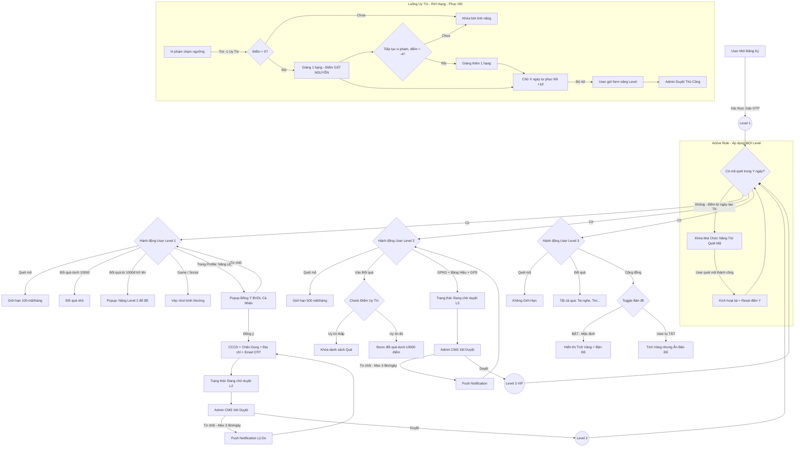

---
{"dg-publish":true,"permalink":"/01-tong-quan-ly-du-an/2-phong-van-hanh/spec-01-verification-levels/","title":"PHÂN CẤP ĐẶC QUYỀN TÀI KHOẢN (VERIFICATION LEVELS)","dg-note-properties":{"title":"PHÂN CẤP ĐẶC QUYỀN TÀI KHOẢN (VERIFICATION LEVELS)"}}
---

# ĐẶC TẢ TÍNH NĂNG
## HỆ THỐNG PHÂN CẤP ĐẶC QUYỀN TÀI KHOẢN (VERIFICATION LEVELS)
**Ứng dụng Chăm Sóc Khách Hàng — Mobile/Web/App/CMS**

**Tên tính năng:** Phân cấp đặc quyền (Level 1-2-3) theo mức độ xác thực
**Mã tính năng:** FEAT-VERIF-LVL
**Phiên bản tài liệu:** v1.2
**Ngày tạo:** 09/04/2026
**Người viết:** Lập trình viên AI / Theo ảnh mô tả
**Đội nhận tài liệu:** Dev Team
**Trạng thái:** Draft

---

## 1. Tổng Quan
### 1.1 Mô tả tính năng
Tính năng "Phân Cấp Đặc Quyền" cho phép hệ thống chia người dùng thành 3 cấp độ (Level 1: Cơ bản, Level 2: Thợ tự do, Level 3: Doanh nghiệp VIP) dựa trên mức độ hoàn thiện hồ sơ định danh cá nhân/doanh nghiệp. Thông qua các mốc Level, hệ thống áp dụng các giới hạn khác nhau về: số lượng mã quét mỗi tháng, quyền đổi quà, quyền tham gia sự kiện và huy hiệu vinh danh trong cộng đồng.

### 1.2 Mục tiêu (Goals)
- Kiểm soát và giới hạn quyền lợi của những tài khoản chưa định danh rõ ràng, giảm thiểu trục lợi và lừa đảo.
- Thúc đẩy người dùng upload hồ sơ eKYC (CCCD/Selfie) và giấy tờ kinh doanh để được nâng cấp quyền lợi.
- Tạo ra sự khác biệt về đặc quyền cho nhóm Doanh nghiệp VIP nhằm tri ân khách hàng thân thiết.

### 1.3 Ngoài phạm vi (Non-goals)
⚠️ Tính năng này KHÔNG bao gồm:
- Quy trình OCR bóc tách giấy tờ tự động. Việc đọc, trích xuất "Số CCCD" và "Mã số thuế" từ ảnh chụp sẽ do Admin làm thủ công hoàn toàn (nhìn ảnh và gõ tay vào form).

## 2. Đối Tượng Người Dùng
### 2.1 Vai trò liên quan

| Vai trò                 | Mô tả                                    | Quyền thực hiện                                                                              |
| ----------------------- | ---------------------------------------- | -------------------------------------------------------------------------------------------- |
| Người dùng (KTV/Đại lý) | Là người sử dụng app cần được phân quyền | Nộp hồ sơ xét duyệt nâng Level, khai thác các đặc quyền theo giới hạn Level hiện có.         |
| Admin / CSKH            | Quản trị dự án từ phía DSS               | Tiếp nhận, kiểm tra tính hợp lệ của CCCD/Giấy phép và duyệt thăng hạng Level cho người dùng. |

### 2.2 User Stories
- [US-01] Là người dùng mới (Level 1), tôi muốn thấy sự giới hạn của tài khoản mình (chỉ được đổi các phần quà dưới 1000 điểm) để tôi có động lực định danh lên Level 2.
- [US-02] Là Thợ lắp đặt (Level 2), tôi muốn được hệ thống ghi nhận Tích Xanh để anh em trong cộng đồng tin tưởng, đồng thời tôi muốn được phép đổi các quà tặng giá trị dưới 10000 điểm.
- [US-03] Là Đại lý lớn (Level 3), tôi muốn tài khoản của mình không bị khoá giới hạn quét mã (Uncapped) và có quyền không giới hạn đổi bất cứ món quà đắt tiền nào trong kho với Tích Vàng danh giá hiển thị khi tham gia bình luận trên cộng đồng.

- [US-04] Là Admin hệ thống, tôi muốn có bảng cấu hình Bật/Tắt module xác thực và thiết lập Threshold cho tính năng đổi quà.
- [US-05] Là Admin hệ thống, tôi muốn có giao diện quản lý phê duyệt hồ sơ trực quan cùng ảnh chụp Upload của User để tôi đối chiếu và nhấn Duyệt/Từ chối kèm lý do
- [US-06] Là Admin hệ thống, tôi muốn thiết lập điều kiện "Kích hoạt tài khoản người dùng thực" (số ngày tối thiểu + ít nhất 1 mã quét) để ngăn chặn nick rác tham gia Minigame/Kiếm điểm.
- [US-07] Là Admin/CSKH, tôi muốn thu thập Họ và tên thật của các tài khoản Level 2/3 để phục vụ công tác giao quà tặng vật lý, in thẻ sự kiện và quản lý Check-in Workshop.

## 3. Yêu Cầu Chức Năng

| Mã      | Mô tả yêu cầu                                                                                                                                                                                                                                                                                                                                                                                                                                                                                                                   | Độ ưu tiên | Ghi chú                                    |
| ------- | ------------------------------------------------------------------------------------------------------------------------------------------------------------------------------------------------------------------------------------------------------------------------------------------------------------------------------------------------------------------------------------------------------------------------------------------------------------------------------------------------------------------------------- | ---------- | ------------------------------------------ |
| FR-01   | **Level 1 (Mặc định):** Kích hoạt vào tài khoản ngay khi xác thực Zalo/SĐT thành công. Giới hạn quét tối đa **100 mã/tháng** (default, Admin cấu hình được). Được phép sử dụng chức năng đổi quà có giá trị **dưới 1000 điểm**. Tên nickname hiển thị màu đen, bình luận ẩn danh.                                                                                                                                                                                                                                                                             | Cao        | Default = 100 mã, cấu hình tại CMS.       |
| FR-02   | **Luồng Cập Nhật Level 2:** Yêu cầu người dùng upload 2 mặt CCCD, **chụp ảnh chân dung thực tế** (sử dụng camera để Admin đối chiếu trực tiếp với khuôn mặt trên CCCD), và Ảnh cửa hàng/chỗ ở. Bổ sung trường nhập liệu: **Họ và tên thật**, **Địa chỉ giao hàng** và bắt buộc tiến hành **xác thực Email** qua mã OTP/Link.                                                                                                                                                                                                                           | Cao        | Chờ CMS admin Approve                      |
| FR-02.1 | **Khóa Dữ Liệu Định Danh:** Ngay khi bộ hồ sơ KYC được duyệt, toàn bộ thông tin lõi (Họ tên, SĐT, Email, CCCD) sẽ bị **KHÓA CỨNG**, người dùng không được phép chỉnh sửa trên App. Trường hợp cần đổi thông tin do sai sót hoặc muốn chuyển nhượng tài khoản, user phải liên hệ CSKH. Admin (CMS) sẽ được cung cấp nút bấm **"Cho phép cập nhật lại tài khoản"**. Khi Admin kích hoạt quyền này, App mới mở form nhập liệu cho người dùng. Sau khi người dùng nộp thông tin mới, tài khoản lập tức bị hạ cấp về Level 1 (Pending) chờ Admin phê duyệt lại. | Cao        | Bảo vệ danh tính, chống trục lợi tuyệt đối |
| FR-02.2 | **Luồng Đồng Ý Thu Thập Dữ Liệu (Consent Flow):** Trước khi User bấm Upload bất kỳ giấy tờ nào (CCCD, Selfie, GPKD), App BẮT BUỘC hiển thị popup "Điều khoản Thu thập & Xử lý Dữ liệu Cá nhân" yêu cầu User tick đồng ý. Nếu không đồng ý, toàn bộ luồng Upload bị Block. Bản ghi thời điểm đồng ý (`consent_timestamp`) lưu vào DB.                                                                                                                                                                                                                           | Cao        | NĐ 13/2023/NĐ-CP về BVDLCN               |
| FR-03   | **Level 2 (KTV/Thợ):** Hạn mức quét nới lỏng thành **500 mã/tháng** (default, Admin cấu hình được). Mở khoá đổi quà với danh mục giá trị **dưới 10000 điểm**. Tên nickname có dấu Tích Xanh (Verified). Tham gia các sự kiện Vòng Quay tầm trung.                                                                                                                                                                                                                                                                                                              | Cao        | Default = 500 mã, cấu hình tại CMS.       |
| FR-04   | **Luồng Cập Nhật Level 3:** Nộp **Giấy Phép Kinh Doanh**, **Hóa đơn nhập hàng** và **Hình ảnh bảng hiệu**. App ép buộc dùng Camera chụp ảnh trực tiếp (Tắt tuỳ chọn Tải lên từ thư viện máy). Bắt buộc thiết bị bật GPS, hệ thống lấy tọa độ chính xác lưu vào Metadata của record ở server-side (không ghim trực tiếp text lên hình ảnh chụp).                                                                                                                                                                                                                              | Cao        | Chờ CMS admin Approve                      |
| FR-05   | **Level 3 (Doanh nghiệp VIP):** Bỏ hoàn toàn giới hạn quét (Không giới hạn mã). Mở khoá TẤT CẢ sản phẩm đổi quà không giới hạn trị giá (Tai nghe, Máy hút bụi, Tivi, và các phần thưởng giá trị cao khác). Nhận Vé đặc quyền tham gia sự kiện Siêu Khuyến Mãi lớn nhất năm.                                                                                                                                                                                                                                                                      | Cao        |                                            |
| FR-06   | **Hiển thị Cộng Đồng (Level 3):** Tên chữ màu Vàng + Tích Vàng. Tính năng bản đồ "Anh em quanh đây" có toggle "Hiển thị tôi trên bản đồ cộng đồng" trong Cài đặt App. **Mặc định là BẬT.** Khi user vừa được duyệt lên Level 3, App hiển thị popup chúc mừng kèm gợi ý: "Bạn đã là VIP! Hãy bật Hiển thị trên Bản đồ để khách hàng dễ tìm đến bạn". User có thể tắt bất kỳ lúc nào.                                                                                                                                                                                                                                                           | Trung bình | Mặc định BẬT, có thể tắt.                  |
| FR-07   | **Luồng cảnh báo Limit:** Khi người chơi đạt mốc mã quét hoặc nhấn vào nút "Đổi quà" vượt Level, hệ thống chặn lại và bung Pop-up gợi ý "Nâng cấp lên Level X để trải nghiệm tính năng này".                                                                                                                                                                                                                                                                                                                                    | Cao        | UI sinh động, Call to Action rõ ràng.      |
| FR-08   | **Admin - Ma trận Bật/Tắt KYC:** CMS thiết kế riêng bảng điều khiển cho phép Admin cấu hình bật/tắt bắt buộc xác thực KYC phân rã **cho từng Level** đối với **từng Module chức năng khác nhau** (Trò chơi / Đổi quà / Quét mã / Thảo luận...).                                                                                                                                                                                                                                                                                 | Cao        | Quản lý thiết lập quyền chuyên sâu         |
| FR-09   | **Admin - Cấu hình Trọng số/Ngưỡng:** Đi kèm bảng Bật/Tắt, Admin được nhập trực tiếp các thông số giới hạn linh hoạt. Ví dụ: Với Module Quét mã thì Level X được quét bao nhiêu mã; với Module Đổi quà thì Level X chỉ được phép đổi quà trị giá bằng bao nhiêu điểm.                                                                                                                                                                                                                                                           | Cao        | Cấu hình số học linh hoạt                  |
| FR-10   | **Admin - Nhập liệu thủ công & Kiểm tra trùng lặp:** Admin đối chiếu ảnh hồ sơ bằng mắt và gõ tay (nhập thủ công) Số CCCD, Mã số thuế vào bộ Form hệ thống. Ngay khi Admin gõ xong, hệ thống tự động kiểm tra chéo (Duplicate check) trên Database (yêu cầu Unique Index trên cột CCCD và MST), hiển thị Cờ báo lỗi Trùng Lặp nếu phát hiện vi phạm.                                                                                                                                                                                                                        | Cao        | Index DB bắt buộc                          |
| FR-10.1 | **Admin - Dữ liệu GPS & Export Excel:** Dữ liệu toạ độ định vị (GPS) của Level 3 phải được hiển thị cụ thể trong mục Thông tin người dùng (User Profile Info). Cho phép truy xuất toàn bộ dữ liệu này ra báo cáo Excel (.xlsx).                                                                                                                                                                                                                                                                                                 | Cao        |                                            |
| FR-11   | **Admin - Thao tác Duyệt/Từ chối:** Admin nhấn 'Duyệt' => Hệ thống Update Level hội viên. Nhấn 'Từ chối' => Bắt buộc nhập quy định lý do lỗi => Bắn Push notification về App cho User kèm lý do xử lý.                                                                                                                                                                                                                                                                                                                          | Cao        | Realtime Status Sync                       |
| FR-12   | **Cơ chế Kích hoạt Tài khoản (Active Rule — Cửa sổ cuốn chiếu):** Áp dụng cho **mọi Level** (1, 2, 3). Bộ đếm `[Y]` ngày bắt đầu tính từ **ngày tạo tài khoản**. Tài khoản phải quét ít nhất **1 mã sản phẩm** trong vòng **`[Y]` ngày gần nhất** (default Y = 60, Admin cấu hình được). Nếu user không có bất kỳ mã quét thành công nào trong `[Y]` ngày liên tiếp, hệ thống tự động **khóa toàn bộ chức năng** (Đổi quà, Game, Social, Cộng đồng) và **chỉ chừa lại chức năng Quét mã**. Ngay tại thời điểm user quét mã thành công trở lại, toàn bộ chức năng thuộc Level hiện tại sẽ được kích hoạt lại từ đầu và bộ đếm `[Y]` ngày bắt đầu tính lại từ 0.                                                                                                                                                                                                                                                                                                      | Cao        | Default Y = 60, đếm từ ngày tạo TK         |
| FR-13   | **Admin - Cấu hình Active Rule:** CMS cung cấp ô nhập số ngày cấu hình `[Y]` (Tenure threshold). Thay đổi này áp dụng ngay lập tức cho toàn bộ tài khoản.                                                                                                                                                                                                                                                                                                                                                  | Trung bình | Cấu hình tham số hệ thống                  |
| FR-14   | **Đồng bộ thông tin sự kiện/Giao hàng:** Thông tin "Họ và tên thật" và **"Địa chỉ giao hàng"** (do user tự khai báo tại luồng KYC Level 2) sau khi Admin duyệt sẽ được trích xuất tự động vào các module: In phiếu giao hàng (Shipping labels), Danh sách khách mời Workshop và mã QR Check-in sự kiện.                                                                                                                                                                                                                                                | Cao        |                                            |
| FR-15   | **Hệ Thống Điểm Uy Tín:** Mỗi tài khoản có tối đa 4 Điểm uy tín. Giới hạn các chức năng (như Đổi Quà) sẽ bị khóa một phần nếu chỉ số uy tín giảm sút ở Level tương ứng. Khoảng điểm có thể kéo xuống mức âm (-4 điểm).                                                                                                                                                                                                                                                                                                | Cao        | Liên kết Spec-09                           |
| FR-16   | **Cơ Chế Rớt Hạng (Demotion):** Khi điểm uy tín giảm, khóa dần tính năng. Khi điểm uy tín tụt lùi về mốc **0 điểm**, hệ thống tự động giáng cấp tài khoản xuống 1 hạng (Vd: L3 -> L2). Điểm uy tín **KHÔNG được reset** khi bị giáng cấp mà giữ nguyên giá trị hiện tại. Nếu tiếp tục vi phạm và điểm chạm mốc **-4 điểm**, hệ thống giáng tiếp 1 hạng nữa (Vd: L2 -> L1).                                                                                                                                                                                                                                                                                                | Cao        | Điểm giữ nguyên, không reset               |
| FR-17   | **Phục Hồi Điểm & Yêu Cầu Duyệt Lại:** Cứ sau mỗi `[X]` ngày (Admin tùy chỉnh được `[X]`), điểm uy tín tự động cộng dồn hồi phục **+1 điểm**. Khi người dùng đã lĩnh án rớt Level, dù điểm uy tín có hồi phục lại đủ mốc an toàn, hệ thống cũng KHÔNG tự động khôi phục Level. Admin buộc phải phê duyệt thủ công thì user mới trở về Level cũ.                                                                                                                                                                                                                                                                                                | Cao        | Admin Review Check                         |
| FR-18   | **Giới hạn Nộp Hồ Sơ (Anti-Spam Upload):** Mỗi tài khoản chỉ được phép nộp hồ sơ xét duyệt nâng Level tối đa **3 lần/ngày**. Vượt quá giới hạn sẽ hiển thị thông báo "Bạn đã vượt quá số lần nộp hồ sơ trong ngày, vui lòng thử lại sau". Admin cấu hình được số lần tối đa trên CMS.                                                                                                                                                                                                                                                                                                | Trung bình | Chống spam tắc hàng đợi Admin              |
| FR-19   | **Xoá Tài Khoản & Lưu Trữ Dữ Liệu:** Khi người dùng yêu cầu xoá tài khoản, hệ thống vô hiệu hoá tài khoản và ẩn khỏi ứng dụng. Toàn bộ dữ liệu định danh (CCCD, Selfie, GPKD) được **giữ lại** trong kho lưu trữ nội bộ (cold storage) để phục vụ đối soát, kiểm tra gian lận và nghĩa vụ pháp lý.                                                                                                                                                                                                                                                                                                | Cao        | NĐ 13/2023/NĐ-CP lưu trữ hợp pháp        |
## 4. Yêu Cầu Phi Chức Năng
### 4.1 Hiệu năng
- API kiểm tra và đối chiếu quyền (Limit quét mã, Limit kho quà) phải trả kết quả tức thời (dưới 300ms) để luồng sử dụng của App không bị gián đoạn.
- Cột `cccd_number` và `tax_code` trong bảng User bắt buộc có **Unique Index** để đảm bảo FR-10 (Duplicate check) chạy real-time ngay cả khi bảng vượt vài triệu records.

### 4.2 Bảo mật
- Ảnh CCCD, Selfie, GPKD mã hoá **at-rest** (AES-256) trên S3 bucket. Truy cập phải thông qua **Signed URL có thời hạn** (expiry ≤ 15 phút), chống lộ lọt ra môi trường internet ngoài hệ thống CMS.

### 4.3 Khả dụng
- Ứng dụng app cung cấp trải nghiệm chụp hình giấy tờ nhanh nhạy, tự crop khung viền nếu có thể để hỗ trợ thao tác KTV tại công trình.

### 4.4 Tuân thủ pháp luật
- Tuân thủ Nghị định 13/2023/NĐ-CP về Bảo vệ Dữ liệu Cá nhân: Có Consent Flow (FR-02.2), lưu trữ `consent_timestamp`, và cơ chế giữ dữ liệu khi xoá tài khoản (FR-19) phục vụ nghĩa vụ pháp lý.

## 5. Luồng Xử Lý (Happy Path)

### 5.1 Sơ đồ luồng (Flowchart)

### 5.2 Các bước chi tiết

| # | Tác nhân | Hành động | Kết quả / Điều kiện |
|---|----------|-----------|---------------------|
| 1 | Người dùng Level 1 | Ấn vào chức năng Đổi phần quà "2000 Điểm" (quà này được Setup vượt ngưỡng 1000 điểm đối với Level 1 đang có) | Hệ thống hiện Popup yêu cầu: "Cần nâng cấp lên Level 2 để đổi vật phẩm này." |
| 2 | Người dùng | Vào trang Profile, nhấn "Nâng cấp tài khoản". App hiển thị popup Điều khoản Thu thập DLCN, user tick Đồng ý. | Consent được ghi nhận. Form Upload mở ra. |
| 3 | Người dùng | Chụp ảnh CCCD 2 mặt, **chụp cận cảnh ảnh chân dung thực tế bằng camera**, chụp Cửa hàng, nhập **Địa chỉ giao hàng**, xác thực Email OTP và gửi đi. | Trạng thái Profile = Đang chờ duyệt Level 2 |
| 4 | Admin (CMS) | Thấy Record hồ sơ. Admin quét mắt đối chiếu ảnh Chân dung thực tế trùng khớp danh tính với khuôn mặt trên thẻ CCCD. Nhấn nút "Approve". | Cấp độ user chuyển thành Level 2 trong Database |
| 5 | Hệ thống | Trả về notification tới App báo tin vui cho khách | Chức năng quét mã được cập nhật threshold là 500 mã; các phần quà có cấu hình ≤ 10000 điểm chuyển sang trạng thái cho phép đổi (enabled); hiển thị Tích Xanh. |
| 6 | Người dùng Level 2 | Bật GPS, dùng Camera App chụp thẳng mặt Bảng Hiệu, Hóa đơn nhập hàng và nộp kèm GPKD | Admin đối chiếu bằng mắt, nhập tay Số CCCD/MST. Hệ thống tự quét báo trùng lặp. Admin Duyệt => Đạt Level 3 VIP. |

## 6. Xử Lý Lỗi & Trường Hợp Ngoại Lệ

| Tình huống lỗi                                   | Thông báo hiển thị                                                                                            | Hành động tiếp theo                                        |
| ------------------------------------------------ | ------------------------------------------------------------------------------------------------------------- | ---------------------------------------------------------- |
| Đạt hạn mức mã quét tối đa của Level 1 / Level 2 | "Bạn đã quét được [XX] mã, đạt mức tối đa của [Level X] tháng này. Nâng cấp ngay để không bỏ lỡ điểm thưởng!" | Chuyển hướng tới trang bổ sung Hồ sơ định danh             |
| Ảnh CCCD hoặc Selfie bị mờ nhòe                  | "Hình ảnh không rõ ràng. Vui lòng chụp tại nơi có ánh sáng tốt và đảm bảo không loá mờ."                      | Cho phép user chụp lại từ App, không lưu ảnh lỗi về server |
| Admin từ chối do Giấy phép rách/sai thông tin    | Không có thông báo trực tiếp mà Admin sẽ tick chọn lý do từ chối trên CMS -> System trả về Push Notification  | Báo người dùng chuẩn bị hồ sơ hợp lệ tải lên lại.          |

## 7. Tiêu Chí Chấp Nhận (Acceptance Criteria)
✅ Tính năng đạt khi:
- [AC-01] Tài khoản Level 1 có thể đổi thưởng bình thường đối với các phần quà trị giá < 1000 điểm. Trỏ vào các quà có cấu hình > 1000 điểm sẽ báo lỗi chạm limit và gợi ý định danh.
- [AC-02] Tài khoản Level 2 bị giới hạn đổi với các phần quà trị giá < 10000 điểm. Chỉ Level 3 mới được tự do không giới hạn trị giá phần quà.
- [AC-03] Tính block limit (default: 100 mã cho Level 1, 500 mã cho Level 2) reset chính xác vào lúc 00:00:00 (GMT+7) ngày đầu tiên của tháng mới.
- [AC-04] Dấu Tích Xanh và Tích Vàng hiển thị chuẩn xác ở mọi nơi trên giao diện App (Leaderboard, Bình luận, Profile, Bản đồ cộng đồng).
- [AC-05] User Level 3 mặc định xuất hiện trên feature "Anh em quanh đây" (toggle mặc định BẬT). Khi vừa được duyệt lên Level 3, App hiển thị popup chúc mừng kèm gợi ý bật bản đồ. User có quyền tắt toggle bất kỳ lúc nào trong Cài đặt.
- [AC-06] Tại CMS, Admin thao tác thành công trên Bảng Ma Trận KYC: Cho phép Bật/Tắt khóa xác thực phân rã độc lập cho từng Level và từng Module (Quét mã/Đổi quà).
- [AC-06.1] Tại CMS, Admin nhập thành công tham số giới hạn Threshold (số lượng mã quét, mức cực đại điểm đổi quà) và áp dụng real-time.
- [AC-07] Thao tác "Từ chối" trên màn hình Approval Workflow của Admin bắt buộc phải có bước nhập lý do. Tại luồng duyệt Level 2, Giao diện CMS PHẢI hiển thị cận cảnh Ảnh Chân dung nằm ngay sát Ảnh CCCD để Admin đối chiếu mắt thường. Hệ thống bắn Push Notification chuẩn nội dung lý do đó tới máy khách.
- [AC-08] Active Rule (Cửa sổ cuốn chiếu): Tài khoản không có bất kỳ mã quét thành công nào trong `[Y]` ngày liên tiếp -> bị khóa tất cả chức năng trừ Quét mã. Popup hiển thị: "Bạn cần quét ít nhất 1 mã sản phẩm để kích hoạt lại tài khoản". Ngay khi quét mã thành công -> mở lại toàn bộ chức năng thuộc Level hiện tại, bộ đếm `[Y]` reset về 0.
- [AC-09] Tại CMS, Admin thay đổi giá trị `[Y]` và nhấn Lưu, hệ thống phải áp dụng logic kiểm tra tức thì cho toàn bộ người dùng.
- [AC-10] Hệ thống chỉ hiển thị dấu Tích Xanh kèm "Họ và tên thật" trên trang cá nhân của các tài khoản đã vượt qua phê duyệt Level 2.
- [AC-11] Tại module CSKH/Quà tặng, khi Admin chọn "Xuất phiếu giao hàng", hệ thống phải lấy đúng "Họ và tên thật" và "Địa chỉ giao hàng" đã được xác minh (thay vì các nickname/Zalo name tự đặt).
- [AC-12] Đối với Module Upload lên Level 3: Nút tải ảnh sẽ chỉ kích hoạt Camera Native của điện thoại (Không mở thư mục Photo Gallery). App hiển thị Pop Notification yêu cầu cấp quyền Định Vị (Location GPS), nếu không bật thì chặn không cho tiến hành chụp ảnh.
- [AC-13] Chức năng kiểm tra Duplicate vận hành real-time ở CMS (backed by Unique Index). Ngay khi Admin gõ tay xong "Số CCCD" hoặc "Mã số thuế" vào Form, nếu giá trị trùng lặp với user cũ đã tạo danh tính trong DB, hệ thống lập tức hiển thị Cảnh báo Trùng Lặp (Duplicate) tại form và nhắc nhở Admin rà soát kĩ rủi ro trục lợi.
- [AC-14] Cụm Admin Panel có cung cấp tính năng "Xuất Excel" đối với danh sách Thông tin Đại lý/User. Kết quả xuất chứa đầy đủ cột thông tin bao gồm Cột Toạ Độ GPS (Dữ liệu Lat/Long).
- [AC-15] Chức năng Khóa Định Danh (Identity Lock): Truy cập App bằng tài khoản Level 2/3, các ô nhập liệu Họ tên, CCCD, Email phải bị vô hiệu hóa hoàn toàn (disable). Trừ phi Admin click nút "Cho phép cập nhật lại tài khoản" ở CMS đối với user đó, các text field này trên App mới mở khóa. Sau khi user điền lại và Submit, tài khoản lập tức bị tước Tích Xanh/Vàng, tước đặc quyền và lùi về Level 1 chờ Admin duyệt.
- [AC-16] Kiểm thử luồng Đánh rớt hạng & Khôi phục: Tool giả lập trừ Điểm Uy Tín của một user Level 3. Khi điểm rớt về 0đ -> Tài khoản bị hạ xuống Level 2. Tiếp tục tụt điểm về -4đ -> Tài khoản bị giáng xuống cấp đáy Level 1. Set nhảy hệ thống qua `[X]` ngày -> điểm tự động cộng dồn +1đ (1đ = X ngày). Khi User có điểm an toàn (4 điểm) và gửi form nâng Level -> Cần phải có thao tác duyệt thủ công của Admin trên CMS thì Level mới được trả lại.
- [AC-17] Consent Flow: Trước khi Upload CCCD/Selfie, App buộc hiện popup đồng ý. Nếu user nhấn "Không đồng ý" -> Upload bị Block hoàn toàn. Hệ thống ghi nhận `consent_timestamp` vào DB.
- [AC-18] Anti-Spam Upload: User nộp hồ sơ nâng Level quá 3 lần/ngày bị chặn với thông báo "Bạn đã vượt quá số lần nộp hồ sơ trong ngày".
- [AC-19] Xoá tài khoản: Sau khi xoá, toàn bộ dữ liệu CCCD/Selfie/GPKD vẫn giữ lại trong cold storage nội bộ. Tài khoản bị vô hiệu hoá và ẩn khỏi mọi giao diện App.
## 8. Phụ Thuộc & Rủi Ro
### 8.1 Phụ thuộc
- Team Marketing và Vận Hành cần quyết định chính xác con số cứng cho giới hạn mức quét và giá trị quà trước khi code.
- Tính năng bản đồ "Anh em quanh đây" phụ thuộc vào việc client thiết bị phải cấp quyền truy cập định vị GPS.

### 8.2 Rủi ro
- Việc khóa quyền đột ngột với những user đang dùng App như bình thường có thể tạo một đợt review phẫn nộ từ khách hàng. **Giải pháp:** Cần có chuỗi thông báo truyền thông và popup cảnh báo 2 tuần trước khi áp dụng cơ chế block thực tế vào sản phẩm.

## 9. Lịch Sử Thay Đổi

| Phiên bản | Ngày | Người thực hiện | Nội dung thay đổi |
|-----------|------|-----------------|-------------------|
| v1.0 | 09/04/2026 | AI DSSCLUB | Áp dụng SKILL và biên soạn dựa trên Table Bảng Phân Cấp Đặc Quyền Tài Khoản do người dùng cung cấp. |
| v1.1 | 22/04/2026 | AI DSSCLUB | Tích hợp Điểm Uy Tín (FR-15~17), Khóa Định Danh (FR-02.1), sửa lỗi chính tả toàn bộ. |
| v1.2 | 22/04/2026 | AI DSSCLUB | Audit lớn: Chốt hạn mức cố định (100/500), Consent Flow (FR-02.2), Active Rule cuốn chiếu (FR-12), Toggle bản đồ opt-in (FR-06), Anti-spam upload (FR-18), Lưu trữ khi xoá TK (FR-19), viết lại Flowchart hoàn chỉnh, bổ sung NFR Bảo mật & Pháp lý (4.2, 4.4). |
