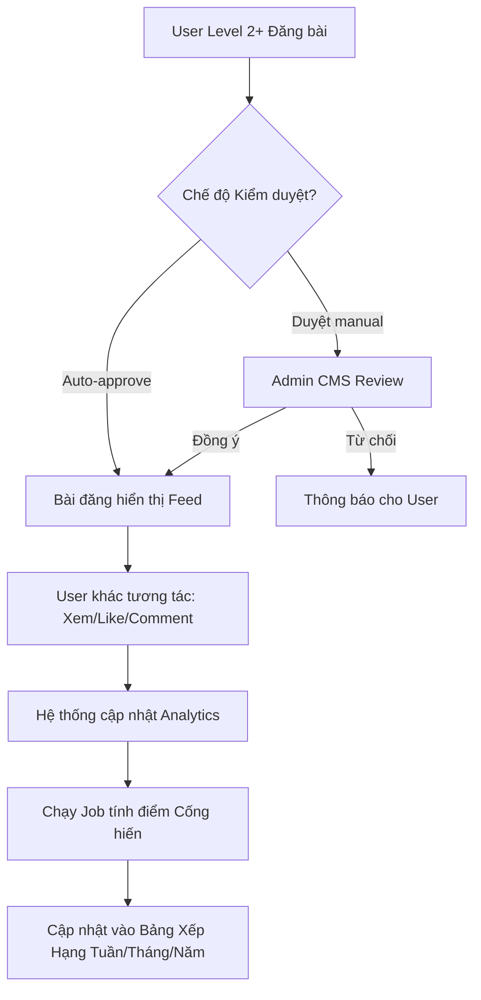
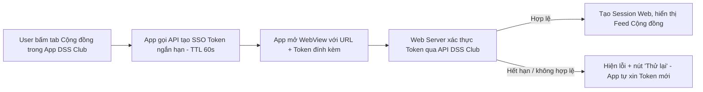

---
{"dg-publish":true,"permalink":"/01-tong-quan-ly-du-an/2-phong-van-hanh/spec-02-social-community/","title":"CỘNG ĐỒNG SOCIAL & HỆ THỐNG ĐIỂM CỐNG HIẾN","dg-note-properties":{"title":"CỘNG ĐỒNG SOCIAL & HỆ THỐNG ĐIỂM CỐNG HIẾN"}}
---

# ĐẶC TẢ TÍNH NĂNG
## CỘNG ĐỒNG SOCIAL & HỆ THỐNG ĐIỂM CỐNG HIẾN
**Ứng dụng Chăm Sóc Khách Hàng — Mobile (iOS/Android) + Web Community + Admin CMS**

**Tên tính năng:** Mạng xã hội nội bộ & Xếp hạng Điểm cống hiến
**Mã tính năng:** FEAT-SOCIAL-GAMIFY
**Phiên bản tài liệu:** v1.1
**Ngày tạo:** 09/04/2026
**Ngày cập nhật:** 22/04/2026
**Người viết:** AI DSSCLUB
**Đội nhận tài liệu:** Dev Team, Marketing Team
**Trạng thái:** Draft / Review

---

## 1. Tổng Quan
### 1.1 Mô tả tính năng
Xây dựng một không gian "Cộng đồng" ngay trong App DSS Club, nơi người dùng (Kỹ thuật viên, Đại lý) có thể chia sẻ kinh nghiệm, hình ảnh công trình và thảo luận. Để tăng tính tương tác, hệ thống áp dụng cơ chế **Điểm cống hiến** — loại điểm tích lũy dựa trên mức độ phổ biến của bài đăng (Lượt xem, Thích, Bình luận). Điểm này dùng để xếp hạng thành viên theo tuần/tháng/năm và vinh danh những người đóng góp tích cực nhất.

### 1.2 Mục tiêu (Goals)
- Tăng tỷ lệ giữ chân người dùng (Retention Rate) và thời gian sử dụng App (Time spent).
- Xây dựng kho nội dung thực tế từ chính người dùng (User Generated Content) để hỗ trợ đào tạo kỹ thuật chéo.
- Tạo sân chơi công bằng, vinh danh những cá nhân/doanh nghiệp có uy tín và sức ảnh hưởng trong ngành.

### 1.3 Ngoài phạm vi (Non-goals)
⚠️ Tính năng này KHÔNG bao gồm:
- Tính năng nhắn tin tức thời (Chat 1-1).
- Tính năng Livestream (giai đoạn 1).

### 1.4 Hướng Tiếp Cận Triển Khai *(Bổ sung v1.1)*
Để tiết kiệm chi phí phát triển và đảm bảo thời gian ra mắt nhanh, tính năng **Cộng đồng** được triển khai theo hướng **Web-first + Nhúng trong App**:

- **Web Community độc lập:** Build 1 website Cộng đồng riêng (ví dụ subdomain `community.dssclub.vn`) — chạy được trên mobile browser, tablet và desktop. Đây là frontend duy nhất — **không làm native UI trong app mobile**.
- **Nhúng vào App qua WebView:** App DSS Club (iOS/Android) mở tab "Cộng đồng" bằng WebView đến website này. User cảm giác như đang dùng tính năng của app.
- **SSO với tài khoản DSS Club:** User đã đăng nhập App → tự động được đăng nhập vào Web Community (truyền token qua URL được mã hóa hoặc cookie chia sẻ). **TUYỆT ĐỐI không được yêu cầu user đăng nhập lần thứ 2.**
- **Admin CMS dùng chung nền tảng Web:** Cùng codebase với Web Community, chỉ khác phân quyền — tiết kiệm ~30% chi phí so với làm CMS riêng biệt.
- **Push Notification vẫn do App mobile bắn** (vì app đã có token FCM/APNS), khi user bấm vào thông báo → app deep-link mở tab Cộng đồng và chuyển đúng bài viết.
- **Bridge Camera/Gallery:** Khi user upload ảnh/video trong WebView → gọi native camera/thư viện qua Bridge để trải nghiệm mượt như native.

**Lợi ích:** Giảm 40–50% chi phí phát triển so với làm native 2 nền tảng, cập nhật nhanh không cần duyệt store, mở rộng được cho user truy cập qua laptop sau này.

## 2. Đối Tượng Người Dùng
### 2.1 Vai trò liên quan

| Vai trò | Mô tả | Quyền thực hiện |
|---------|-------|-----------------|
| Thành viên (Level 1) | Người dùng mới | Xem bài viết, Bình luận ẩn danh (Nickname đen). Không được đăng bài hoặc tích điểm. |
| Thành viên (Level 2+) | KTV/Đại lý đã xác thực | Đăng bài (Ảnh/Video), Tương tác, Tích lũy điểm cống hiến, Hiển thị Tích xanh. |
| Admin / Moderator | Ban quản trị DSS | Cấu hình tham số tính điểm, phê duyệt nội dung, quản lý bảng xếp hạng. |

### 2.2 User Stories
- [US-01] Là KTV, tôi muốn chia sẻ ảnh "Giải pháp lắp đặt camera khó" của mình để anh em khác tham khảo và tích lũy điểm cống hiến để lên Top bảng xếp hạng tháng.
- [US-02] Là người dùng, tôi muốn xem các bài viết Hot nhất trong tuần để cập nhật mẹo kỹ thuật mới từ những người có thứ hạng cao.
- [US-03] Là Admin, tôi muốn có thể điều chỉnh công thức tính điểm (ví dụ: tăng trọng số cho Lượt xem) khi có chiến dịch Marketing đặc biệt.

## 3. Yêu Cầu Chức Năng (Hệ thống có thể cài đặt - Configurable)

| Mã | Mô tả yêu cầu | Độ ưu tiên | Ghi chú |
|----|---------------|------------|---------|
| FR-01 | **Bảng tin (Community Feed):** Hiển thị danh sách bài đăng theo thời gian thực hoặc theo thuật toán "Hot" (dựa trên tương tác). Hỗ trợ định dạng Text, Image (Up to 9), Video. | Cao | |
| FR-02 | **Quyền Đăng bài (Posting Permission):** Admin có thể cài đặt Level tối thiểu để được đăng bài (Mặc định: Level 2). | Cao | Configurable |
| FR-03 | **Tương tác:** Cho phép Thích (Like), Bình luận (Comment), Chia sẻ (Share) và theo dõi Lượt xem (View count). | Cao | |
| FR-04 | **Hệ thống Điểm cống hiến:** Tự động cộng điểm cho Chủ bài đăng dựa trên tương tác. Công thức tính điểm phải cho phép Admin thay đổi hệ số nhân (Multipliers) trên CMS. | Cao | Configurable |
| FR-05 | **Bảng xếp hạng (Leaderboard):** Hiển thị Top 10/50 người có điểm cống hiến cao nhất theo 3 mốc: Tuần, Tháng, Năm. | Cao | |
| FR-06 | **Admin - Cơ chế kiểm duyệt:** Cho phép chuyển đổi giữa 3 chế độ: 1. Đăng ngay (Auto), 2. Duyệt trước khi đăng (Manual), 3. Chỉ duyệt bài có từ khóa nhạy cảm. | Cao | Configurable |
| FR-07 | **Huy hiệu Vinh danh:** Tự động gắn huy hiệu "Top Tuần", "Chuyên gia" dựa trên thứ hạng cho Profile user. | Trung bình | |
| FR-08 | **Báo cáo bài viết / bình luận** *(Bổ sung v1.1)*: Mỗi bài viết/comment có nút "Báo cáo". Khi một nội dung bị báo cáo bởi ≥ 5 user khác nhau → tự động ẩn khỏi Feed và chuyển vào hàng chờ Admin duyệt. Admin có thể tùy chỉnh ngưỡng này trong CMS. | Cao | Configurable |
| FR-09 | **Giới hạn Media khi upload** *(Bổ sung v1.1)*: Hệ thống cưỡng chế giới hạn kích thước/thời lượng file (chi tiết tại **mục 3.1**). Nén ảnh tự động phía client (browser) trước khi upload để giảm băng thông và tăng tốc load trên mobile. | Cao | |
| FR-10 | **Xử lý User bị Ban / Tự xóa bài** *(Bổ sung v1.1)*: Khi user bị Ban → ẩn toàn bộ bài viết, comment, điểm của user đó khỏi Feed và Leaderboard (không xóa cứng khỏi DB). Khi user tự xóa bài → trừ lại toàn bộ điểm đã cộng từ bài đó. | Cao | |

### 3.1 Giới hạn Media *(Bổ sung v1.1)*

| Loại | Giới hạn | Ghi chú kỹ thuật |
|------|----------|------------------|
| Ảnh | ≤ 5MB/ảnh, tối đa 9 ảnh/bài, định dạng JPG/PNG/WebP | Nén phía client (browser/WebView) xuống ≤ 1MB và resize về chiều dài tối đa 1600px trước khi upload → giảm mạnh băng thông server và tăng tốc load trên mobile |
| Video | ≤ 50MB/file, ≤ 60 giây, định dạng MP4 (H.264) | Hiển thị thanh tiến trình upload, cho phép hủy giữa chừng. Tạo thumbnail tự động phía server |
| Tổng dung lượng 1 bài | ≤ 100MB | Áp dụng cho mọi bài đăng |

## 4. Đặc tả logic Điểm Cống Hiến (Chi tiết cài đặt)
Hệ thống tính điểm dựa trên sự kiện (Event-based calculation).

### 4.1 Công thức mặc định
`Tổng điểm = (Lượt xem * A) + (Lượt thích * B) + (Bình luận * C) + (Bài đăng * D)`
- **A (Hệ số View):** 0.1 điểm / View.
- **B (Hệ số Like):** 1 điểm / Like.
- **C (Hệ số Comment):** 2 điểm / Comment (Chỉ tính comment từ các User khác nhau).
- **D (Hệ số Post):** 5 điểm / Bài đăng được duyệt.

### 4.2 Cấu hình chống gian lận (Anti-Spam)
- Giới hạn điểm tích lũy tối đa từ 1 bài đăng (E.g: Max 500 điểm/bài).
- Giới hạn điểm tích lũy tối đa mỗi ngày cho 1 User (E.g: Max 200 điểm/ngày).
- Chỉ tính View từ User duy nhất (Unique View) trong vòng 24h.

## 5. Luồng Xử Lý (Flowchart)

### 5.1 Luồng Đăng bài & Tích điểm

### 5.2 Luồng SSO giữa App và Web Community *(Bổ sung v1.1)*

## 6. Xử Lý Lỗi & Trường Hợp Ngoại Lệ

| Tình huống lỗi | Thông báo hiển thị | Hành động tiếp theo |
|----------------|--------------------|---------------------|
| User Level 1 cố tình đăng bài | "Yêu cầu định danh Level 2 để được tham gia đóng góp cộng đồng." | Chuyển hướng sang trang eKYC |
| Nội dung chứa từ khóa cấm | "Bài viết chứa nội dung không phù hợp và đã bị chuyển đến bộ phận kiểm duyệt." | Đẩy bài vào trạng thái Chờ duyệt (Pending Review) |
| Lỗi mạng khi upload Video nặng | "Kết nối không ổn định. Đang thử lại..." | Resume upload hoặc báo lỗi sau 3 lần thử. |
| Ảnh/Video vượt giới hạn *(v1.1)* | "File vượt dung lượng cho phép (ảnh ≤ 5MB, video ≤ 50MB/60s). Vui lòng chọn file nhỏ hơn." | Chặn ngay ở client, không gửi lên server |
| SSO Token hết hạn khi mở WebView *(v1.1)* | "Phiên đã hết hạn. Đang kết nối lại..." | App tự động gọi API cấp Token mới và reload WebView (user không cần thao tác) |
| Bài bị ≥ 5 user báo cáo *(v1.1)* | (Không hiển thị cho user cuối) — gửi thông báo cho Admin | Tự động ẩn bài khỏi Feed, đưa vào hàng chờ Admin review |

## 7. Tiêu Chí Chấp Nhận (Acceptance Criteria)
✅ Tính năng đạt khi:
- [AC-01] Admin có thể thay đổi hệ số nhân (A, B, C, D) trên CMS và điểm bắt đầu được tính theo hệ số mới ngay lập tức cho các tương tác sau đó.
- [AC-02] Bảng xếp hạng Tuần phải tự động reset vào 00:00 sáng Thứ Hai hàng tuần.
- [AC-03] Người dùng đạt Top 3 Bảng xếp hạng tháng phải nhận được thông báo Push vinh danh.
- [AC-04] Hệ thống không tính điểm cho những tương tác tự Like/Comment bởi chính chủ bài đăng.
- [AC-05] Màn hình CMS hiển thị đầy đủ danh sách bài đăng chờ duyệt với ảnh/video rõ nét.

## 8. Phụ Thuộc & Rủi Ro
### 8.1 Phụ thuộc
- **Hạ tầng lưu trữ Media — tiếp cận tiết kiệm (v1.1):**
  - **Giai đoạn 1 (mặc định):** Lưu ảnh/video trực tiếp trên **server nội bộ của DSS Club**, phục vụ qua Nginx với cache aggressive + header `Cache-Control: public, max-age=31536000`. Kết hợp nén ảnh phía client (xem FR-09) → giảm tải băng thông đáng kể.
  - **Giai đoạn 2 (chỉ khi cần):** Nếu đo được **thời gian load trung bình trên mobile 4G > 3 giây** HOẶC **băng thông server > 70% trong giờ cao điểm** → mới chuyển sang CDN giá rẻ (Cloudflare Free Plan hoặc Bunny.net, chi phí ~1-5 USD/tháng cho lưu lượng ban đầu). Thiết kế hệ thống phải cho phép chuyển đổi dễ dàng bằng cách cấu hình base URL của CDN.
  - **Tối ưu hiệu năng bắt buộc ngay từ v1:** Nén ảnh client-side, lazy-load ảnh khi scroll Feed, dùng định dạng WebP nếu trình duyệt hỗ trợ, tạo 2 kích thước (thumbnail + full) cho mỗi ảnh.
- **Background Job (Worker)** để xử lý việc tính toán điểm số cho hàng ngàn tương tác mỗi ngày mà không làm treo Server.
- **API SSO** tích hợp với hệ thống tài khoản DSS Club hiện tại — cần cung cấp endpoint cấp Token ngắn hạn (TTL 60s) để App mobile truyền sang WebView.
- **Bridge Native ↔ WebView** cho camera/thư viện ảnh — cần phối hợp giữa team Mobile và team Web.

### 8.2 Rủi ro
- **Point Farming:** Nhóm người dùng ảo tương tác chéo để lấy điểm. **Giải pháp:** Áp dụng thuật toán Unique IP/Device và giới hạn trần (Limit Caps) mỗi bài đăng.
- **Nội dung độc hại:** **Giải pháp:** Tích hợp bộ lọc từ khóa nhạy cảm tự động và nút "Báo cáo bài viết" cho cộng đồng (FR-08).
- **Server nội bộ quá tải khi có nhiều video HD** *(v1.1)*: **Giải pháp:** Giám sát băng thông hàng tuần, khi ngưỡng cảnh báo → kích hoạt CDN theo Giai đoạn 2. Giới hạn video 50MB/60s để kiểm soát ngay từ đầu.
- **SSO Token bị rò rỉ trong log WebView** *(v1.1)*: **Giải pháp:** Token TTL ngắn (60s, dùng 1 lần), sau khi xác thực xong Web tạo session cookie HttpOnly riêng, không dùng lại Token cũ.

## 9. Lịch Sử Thay Đổi

| Phiên bản | Ngày | Người thực hiện | Nội dung thay đổi |
|-----------|------|-----------------|-------------------|
| v1.0 | 09/04/2026 | AI DSSCLUB | Khởi tạo tài liệu dựa trên yêu cầu của User về Community Feed & Gamification. |
| v1.1 | 22/04/2026 | AI DSSCLUB | Bổ sung **mục 1.4** Kiến trúc Web-first + SSO + WebView. Bổ sung **FR-08** (Báo cáo), **FR-09** (Giới hạn Media), **FR-10** (Xử lý user ban/xóa bài). Thêm **mục 3.1** bảng Giới hạn Media. Thêm **mục 5.2** Luồng SSO. Bổ sung 3 dòng xử lý lỗi mới (Media vượt giới hạn, SSO hết hạn, Bài bị báo cáo). Cập nhật **mục 8.1** chiến lược lưu trữ media **ưu tiên server nội bộ** với tối ưu nén client + lazy load, chỉ dùng CDN khi vượt ngưỡng. **Giữ nguyên toàn bộ nội dung v1.0.** |
