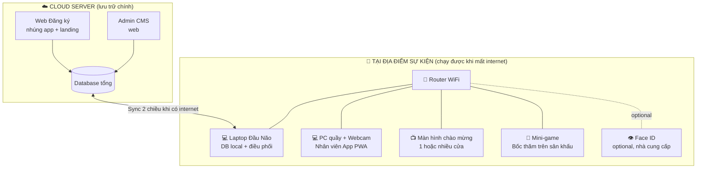
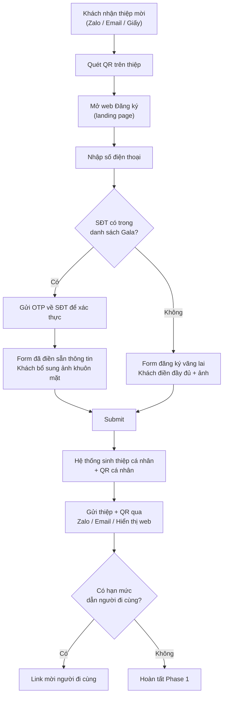
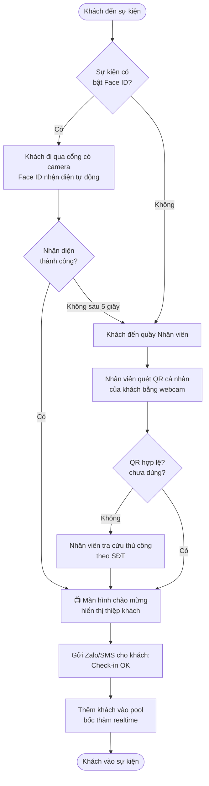
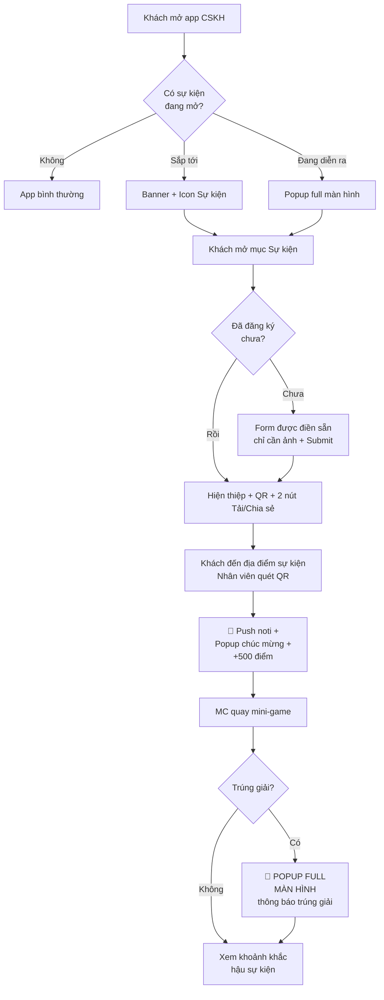

---
{"dg-publish":true,"permalink":"/01-tong-quan-ly-du-an/2-phong-van-hanh/spec-03-v2-event-checkin/","title":"HỆ THỐNG CHECK-IN SỰ KIỆN V2 — VẬN HÀNH & THIẾT KẾ","dg-note-properties":{"title":"HỆ THỐNG CHECK-IN SỰ KIỆN V2 — VẬN HÀNH & THIẾT KẾ"}}
---


# ĐẶC TẢ TÍNH NĂNG
## HỆ THỐNG CHECK-IN SỰ KIỆN V2
**Ứng dụng Chăm Sóc Khách Hàng — Web (nhúng trong App + Landing) + Hạ tầng tại địa điểm sự kiện**

| Mục | Nội dung |
|---|---|
| **Tên tính năng** | Check-in sự kiện thông minh (QR Core + Face ID Plug-in) |
| **Mã** | FEAT-EVENT-CHECKIN-V2 |
| **Phiên bản** | v2.3 |
| **Ngày cập nhật** | 23/04/2026 |
| **Người viết** | AI DSSCLUB |
| **Đối tượng đọc** | Các bên liên quan, Đội vận hành, Dev Team (phần phụ lục) |
| **Trạng thái** | Draft / Review |

> **Hướng dẫn đọc tài liệu:**
> - **Phần I** (Tổng quan): dành cho lãnh đạo, sales, marketing, operation — đọc để hình dung toàn bộ hệ thống.
> - **Phần II** (Luồng vận hành): dành cho đội vận hành triển khai sự kiện — đọc để biết quy trình từng bước.
> - **Phần III** (Yêu cầu vận hành): dành cho project manager — đọc để lập kế hoạch & quản lý rủi ro.
> - **Phần IV** (Phụ lục kỹ thuật): dành cho Dev team — đọc để triển khai code & API.

---

# PHẦN I — TỔNG QUAN HỆ THỐNG

## 1. Tóm tắt 1 phút

DSS CLUB cần **một hệ thống check-in sự kiện độc lập**, dùng được cho mọi loại sự kiện từ Workshop nhỏ (30 khách) đến Gala lớn (1000 khách). Hệ thống gồm 5 phần chính:

1. **Đăng ký trước sự kiện** — Khách quét QR trên thiệp mời → điền thông tin → nhận thiệp cá nhân hóa.
2. **Check-in tại sự kiện** — Khách quét QR (hoặc nhận diện khuôn mặt) → vào cửa nhanh.
3. **Hiển thị thiệp chào đón** — Màn hình lớn hiện thiệp + ảnh khách khi check-in xong, tạo cảm giác "wow".
4. **Bốc thăm trúng thưởng** — MC quay số trên sân khấu, hệ thống tự chọn ngẫu nhiên từ khách đã check-in.
5. **Tích hợp App CSKH** — Khách dùng app DSS được nhận diện tự động, nhận điểm thưởng + thông báo trúng giải in-app.

Toàn bộ chạy được **kể cả khi mất internet** tại địa điểm sự kiện.

## 2. 5 Nguyên Lý Vận Hành Cốt Lõi

Đây là 5 quyết định thiết kế quan trọng nhất, định hướng toàn bộ hệ thống:

**Nguyên lý 1 — Hệ thống độc lập, Face ID là module ngoài:** DSS sở hữu 100% phần mềm. Face ID chỉ bật cho sự kiện đặc biệt, do nhà cung cấp cung cấp, cắm vào qua API chuẩn. Đổi nhà cung cấp không cần sửa hệ thống.

**Nguyên lý 2 — Local là chính, Cloud là phụ:** Tại địa điểm sự kiện, mọi thiết bị nói chuyện với "trung tâm tại chỗ" (laptop đầu não). Cloud chỉ để lưu trữ + báo cáo từ xa. Mất internet → vẫn check-in bình thường.

**Nguyên lý 3 — Web first, không ép cài app:** Khách dùng web (qua Zalo/Email/QR), không bắt buộc cài app CSKH. Nhân viên dùng web PWA trên PC + webcam. Chỉ Màn hình chào mừng + Mini-game cần phần mềm cài sẵn trên máy tính BTC.

**Nguyên lý 4 — QR là luồng chính, Face ID là tăng tốc:** Mọi khách đều có QR cá nhân ký số. Face ID (nếu bật) chỉ giúp đi qua cổng nhanh hơn. Face ID hỏng → QR vẫn cứu được tình huống.

**Nguyên lý 5 — Tùy biến cao cho operations:** Admin tự tạo thiệp mới (upload HTML), tự cấu hình bốc thăm (nhiều vòng, nhiều đối tượng), tự điều chỉnh từng sự kiện không cần Dev can thiệp.

## 3. Sơ Đồ Hệ Thống Tổng Quan



**Đọc sơ đồ thế nào:**
- **Cloud** ở trên: nơi lưu trữ chính, Admin truy cập từ văn phòng.
- **Địa điểm sự kiện** ở dưới: hệ thống tại chỗ, gồm 1 router WiFi + các thiết bị cắm vào router.
- **Đường liền nét**: kết nối bắt buộc.
- **Đường đứt**: tùy chọn (Face ID).
- Đường giữa Cloud ↔ Địa điểm sự kiện: chỉ cần khi sync, không cần thường xuyên.

## 4. Phân Tầng Khách Mời

Hệ thống thiết kế cho 3 loại khách, mỗi loại có trải nghiệm phù hợp:

| Loại khách | Cách nhận thiệp | Cách check-in | Đặc điểm |
|---|---|---|---|
| **Khách mời có danh sách** (đối tác, khách thân thiết) | Zalo / Email / Thiệp giấy | QR cá nhân + Face ID (nếu có) | Điền sẵn thông tin, có hạn mức dẫn người đi cùng |
| **Khách vãng lai** (đăng ký mở) | Quét QR trên standee tại sự kiện | QR cá nhân | Tự điền form đầy đủ |
| **Khách VIP / Sếp lớn** (ưu tiên cao) | Thiệp giấy in cao cấp | Lễ tân đón cá nhân + QR | Có hiệu ứng đặc biệt trên Màn hình chào mừng |

## 5. Phân Loại Sự Kiện

Hệ thống dùng được cho 3 quy mô sự kiện, hạ tầng khác nhau:

| Quy mô | Số khách | Số cửa | Hạ tầng cần | Có Face ID? |
|---|---|---|---|---|
| **Nhỏ — Workshop** | 30-100 | 1 | 1 router + 1 laptop đầu não + 1 PC quầy (kiêm Welcome) + 1 TV | Không cần |
| **Vừa — Hội thảo** | 100-300 | 1-2 | 1 router + 1 laptop đầu não + 2 PC quầy (kiêm Welcome) + 2 TV | Tùy chọn |
| **Lớn — Gala** | 300-1000 | 2-3 | 1 router + 1 laptop đầu não + 3 PC quầy (kiêm Welcome) + 3 TV + Face ID nhà cung cấp | Có |

> **Ghi chú:** Mỗi PC quầy nối **2 màn hình** — màn hình PC cho Nhân viên thao tác, màn hình TV cho khách xem Màn hình chào mừng. Tiết kiệm được 3 Mini PC so với thiết kế cũ.

## 6. Hạ Tầng Cần Chuẩn Bị Tại Địa điểm sự kiện

### 6.1 Sơ đồ kết nối thiết bị — Phương án A (Gọn & Tối ưu)

**Ý tưởng cốt lõi:** Mỗi PC quầy nối **2 màn hình** — vừa là màn hình làm việc cho Nhân viên, vừa là Màn hình chào mừng cho khách. **Không cần Mini PC riêng.**

```
                          📡 Router WiFi
                         (TP-Link AX55 hoặc tương đương)
                                  │
        ┌──────────┬───────────┬──┴────────┐
        │          │           │           │
   💻 Laptop    PC Cửa A    PC Cửa B    PC Cửa C
   ĐẦU NÃO    (Webcam +   (Webcam +   (Webcam +
   (DB local)  2 màn hình) 2 màn hình) 2 màn hình)
                   │            │           │
                   ▼            ▼           ▼
              📺 TV Cửa A   📺 TV Cửa B  📺 TV Cửa C
              (Welcome)     (Welcome)    (Welcome)
```

**Tổng: 4 thiết bị máy tính** (1 laptop đầu não + 3 PC quầy) + 3 TV thuê tại địa điểm sự kiện.

**Cách hoạt động của PC quầy "2 trong 1":**
- **Cổng HDMI 1** → Màn hình PC (Nhân viên thao tác quét QR, xem thông tin khách).
- **Cổng HDMI 2** → TV (hiển thị Màn hình chào mừng cho khách bên ngoài).
- Phần mềm Nhân viên App chạy cửa sổ 1, Chrome full-screen Màn hình chào mừng chạy cửa sổ 2 trên màn hình kia.

**Trong trường hợp Gala lớn 1000+ khách, ngân sách thoải mái:** Có thể tách thành **Phương án D** (thêm 3 Mini PC riêng cho Màn hình chào mừng) — chi tiết trong Phụ lục IV.

### 6.2 Shopping List (đầu tư 1 lần, dùng nhiều sự kiện)

| Đồ | Số lượng | Giá tham khảo | Ghi chú |
|---|---|---|---|
| Router WiFi (TP-Link AX55) | 1 + 1 dự phòng | 1.5tr × 2 = **3tr** | TP-Link bình thường là đủ, không cần loại đặc biệt |
| Laptop Đầu Não | Tận dụng có sẵn | 0 | Laptop văn phòng i5/8GB là đủ |
| Laptop dự phòng | 1 | Tận dụng | Dự phòng trường hợp đầu não hỏng |
| **PC quầy Nhân viên (kiêm Màn hình chào mừng)** | 3 (1/cửa) | 6tr × 3 = **18tr** | **Yêu cầu 2 cổng xuất hình (HDMI + HDMI/VGA), i5 + 8GB RAM để chạy song song Nhân viên App + Welcome** |
| Webcam Logitech C920 | 3 | 1.5tr × 3 = **4.5tr** | Quét QR + đối chiếu khuôn mặt |
| Máy quét QR cầm tay (tùy chọn) | 3 | 1tr × 3 = **3tr** | Tăng tốc khi đông khách |
| Cục phát WiFi 4G dự phòng | 1 | **1tr** | Backup khi WiFi địa điểm sự kiện chết |
| UPS (lưu điện) | 1 | **1tr** | Phòng cúp điện |
| Cáp HDMI dài + phụ kiện | Bộ | **2tr** | Nối PC quầy với TV cách 3-5m |
| **Tổng đầu tư** | | **~32 triệu** | Giảm 5tr so với thiết kế cũ (không cần 3 Mini PC) |

**Đồ thuê tại địa điểm sự kiện:** TV/Máy chiếu × 3 cửa.

> **Tiết kiệm so với Phương án cũ (7 thiết bị):** Bỏ 3 Mini PC (9tr) nhưng nâng cấp PC quầy lên loại có 2 cổng xuất hình (+3tr) + cáp HDMI dài (+1tr) → **tiết kiệm ròng ~5 triệu**.

### 6.3 Bảng "Thiết bị nào cần cài gì"

| Thiết bị | Cần cài app? | Phần mềm gì |
|---|---|---|
| Điện thoại khách | ❌ Không | Mở Zalo / Trình duyệt (web đăng ký) |
| Laptop Đầu Não | ✅ Có | 1 file installer của hệ thống (.exe), cài 1 lần |
| PC quầy Nhân viên (kiêm Welcome) | ❌ Không | Mở Chrome 2 cửa sổ: Cửa sổ 1 (Nhân viên App PWA) ở màn hình PC, Cửa sổ 2 (Màn hình chào mừng full-screen) ở màn hình TV |
| Laptop MC bốc thăm | ❌ Không | Mở Chrome, vào URL Bốc thăm |
| Tablet (nếu dùng thay PC quầy) | ✅ Có | App Nhân viên dạng APK Android, cài 1 lần |

## 7. Tính Năng Trực tuyến vs Ngoại tuyến

Bảng này dành cho Operation team biết trước "mất internet thì cái gì còn chạy, cái gì không":

| Tính năng | Trực tuyến | Ngoại tuyến (mất internet) |
|---|---|---|
| Khách quét QR check-in tại quầy | ✅ Bình thường | ✅ Bình thường |
| Hiển thị Màn hình chào mừng | ✅ Bình thường | ✅ Bình thường |
| Bốc thăm trên sân khấu | ✅ Bình thường | ✅ Bình thường |
| Face ID (nếu bật) | ✅ Bình thường | ⚠️ Phụ thuộc nhà cung cấp (thường cần internet riêng của nhà cung cấp) |
| Admin xem bảng điều khiển từ văn phòng | ✅ Thời gian thực | ❌ Không cập nhật, chờ sync |
| Gửi Zalo/SMS thông báo cho khách | ✅ Gửi ngay | ⏸ Delay, gửi khi có internet lại |
| Khách vãng lai đăng ký mới tại chỗ | ✅ OK | ❌ Cần workaround (form giấy → nhập sau) |
| In thẻ đeo tại chỗ | ✅ OK | ✅ OK (nếu in từ data local) |

**Nguyên tắc:** Internet là **bonus**, không phải requirement. Hệ thống thiết kế để giả định internet không có; có internet thì chạy mượt hơn + có bảng điều khiển thời gian thực.

## 8. Phép So Sánh Dễ Hiểu — "Trụ Sở + Chi Nhánh Tạm"

Tưởng tượng DSS có:
- **Trụ sở chính** ở Hà Nội (= Cloud Server) — lưu tất cả khách hàng, bảng điều khiển.
- **Chi nhánh tạm** dựng tại địa điểm sự kiện (= Laptop Đầu Não) — phục vụ trong ngày sự kiện.

**Trước sự kiện:** Trụ sở chính gửi xuống chi nhánh tạm danh sách 500 khách dự kiến + ảnh.

**Trong sự kiện:** Nhân viên (PC quầy) chỉ giao dịch với chi nhánh tạm tại địa điểm sự kiện. Không gọi về trụ sở chính.

**Sau sự kiện (hoặc bất cứ khi nào có internet):** Chi nhánh tạm báo cáo lên trụ sở mọi giao dịch trong ngày.

→ Nhân viên **không cần biết** hôm nay có internet hay không, vì luôn làm việc với chi nhánh tạm.

---

# PHẦN II — LUỒNG VẬN HÀNH CHI TIẾT

## A. Phase 1 — Đăng Ký Trước Sự Kiện

### A.1 Luồng tổng quan



### A.2 QR universal trên thiệp mời

- Mỗi sự kiện (Gala / Workshop) có **1 QR DUY NHẤT** in trên toàn bộ thiệp mời + standee.
- QR này **không chứa thông tin khách** — ai quét cũng ra cùng 1 trang.
- Phân luồng theo SĐT khi khách điền form, không phụ thuộc QR.

### A.3 Kiểm tra SĐT & Phân luồng

**Bước 1:** Khách nhập SĐT.

**Bước 2:** Hệ thống tra cứu trong danh sách Admin upload sẵn:
- **Có trong danh sách** → gửi OTP 6 số (qua SMS/Zalo) để xác thực → form Gala được điền sẵn.
- **Không có trong danh sách** → form đăng ký vãng lai (cho Workshop).

**Bước 3 (lý do dùng OTP):** Tránh trường hợp ai đó biết SĐT của VIP, nhập vào để xem thông tin điền sẵn → lộ data. Bắt buộc xác thực mới được điền sẵn.

### A.4 Form thu thập thông tin

**Form Gala (được điền sẵn):** Họ tên, Công ty, Chức vụ, Email — đã có sẵn từ data Admin upload, khách sửa được Email, không sửa được Họ tên/Công ty (giữ tính chính xác).

**Form vãng lai:** Khách điền đầy đủ Họ tên, SĐT, Email, Công ty, Chức vụ + các trường tùy chọn Admin cấu hình.

**Cả 2 form đều bắt buộc:** Ảnh khuôn mặt chụp trực tiếp bằng camera (không cho upload từ thư viện), có khung guide chuẩn để ảnh đạt chất lượng.

### A.5 Plus-One — Người đi cùng

- Khi Admin upload danh sách, **mỗi khách có cột "Hạn mức người đi cùng"** (mặc định 0; sếp lớn có thể 2-3).
- Sau khi đăng ký xong, khách thấy: *"Bạn được dẫn thêm {N} người. [Thêm người đi cùng]"*.
- Khách chia sẻ link mời cho người đi cùng → người đi cùng tự điền form (giống form Gala) → được sinh QR riêng.
- Cấu hình: deadline khai +1, +1 có được tham gia bốc thăm không, +1 có cần ảnh khuôn mặt không.

### A.6 Identity Resolution — Đồng bộ data đa kênh

**Nguyên tắc:** Cùng 1 SĐT, dù đăng ký qua kênh nào (App CSKH / Landing page / Người đi cùng), hệ thống tự **gộp về 1 record duy nhất**, không tạo trùng lặp.

**Quy tắc gộp:**
- Khóa chính: SĐT (chuẩn hóa về dạng +84xxxxxxxxx).
- Khi gộp: giữ thông tin cũ, cập nhật trường mới (nếu có), cập nhật ảnh mới nhất.
- Mỗi record có flag nguồn: APP / LANDING / IMPORT / PLUS_ONE để Admin biết.

### A.7 Gửi thiệp + QR cá nhân cho khách

Sau khi đăng ký xong, hệ thống gửi đa kênh để chắc chắn khách nhận được:
- **Zalo ZNS** (chính): Tỷ lệ mở cao nhất tại VN.
- **Email** (phụ): Có thiệp đính kèm dạng ảnh + link xem trực tuyến.
- **Trong app CSKH** (nếu khách đăng ký qua app): Hiện ở tab "Sự kiện của tôi".
- **Trang Thank You sau khi submit**: Có nút "Lưu vào ảnh" để khách chụp màn hình ngay.

## B. Phase 2 — Check-in Tại Sự Kiện

### B.1 Luồng tổng quan



### B.2 Quy trình tại quầy Nhân viên

**1. Khách đến quầy:** Giơ điện thoại có QR (hoặc thiệp giấy).

**2. Nhân viên quét QR:** 2 cách song song:
- Khách đặt điện thoại trước **webcam** trên PC, hệ thống tự nhận.
- Hoặc Nhân viên dùng **máy quét QR cầm tay** bóp cò siêu nhanh.

**3. PC hiển thị thông tin khách:**
- Tên + Công ty
- Ảnh đã thu thập trước đó (để Nhân viên đối chiếu mắt thường với khách thật).
- Flag đặc biệt: VIP / Báo chí / BTC.

**4. Nhân viên bấm nút "Xác nhận":**
- Hệ thống đánh dấu QR đã dùng (sử dụng một lần).
- Màn hình chào mừng hiển thị thiệp khách lên TV trong < 1 giây.
- Khách nhận Zalo/SMS thông báo (nếu có internet).
- Khách được thêm vào pool bốc thăm.

**5. Trường hợp khách mất QR / hết pin:** Nhân viên dùng ô "Tra cứu thủ công" → nhập SĐT → tìm khách → check-in thủ công.

### B.3 Màn hình chào mừng — Hiển thị thiệp chào đón

**Cách hoạt động (Phương án A — PC quầy 2-trong-1):**
- PC quầy Nhân viên nối **2 màn hình**: màn hình PC (Nhân viên thao tác) + TV (Màn hình chào mừng).
- Trên PC mở **2 cửa sổ Chrome**:
  - Cửa sổ 1 → Nhân viên App (nhìn trên màn hình PC).
  - Cửa sổ 2 → URL Màn hình chào mừng, kéo sang TV, bấm F11 full-screen.
- Khi Nhân viên xác nhận check-in OK → laptop đầu não gửi lệnh "hiển thị thiệp khách X" → màn hình TV tự động cập nhật trong < 1 giây.
- Mỗi khách hiển thị 5-8 giây (Admin cấu hình).
- Có hiệu ứng + âm thanh chào mừng nhẹ.

**Nhiều khách cùng check-in:** Màn hình chào mừng xếp hàng hiển thị từng khách một (FIFO), không bị chồng chéo.

**Khách VIP:** Có hiệu ứng đặc biệt (cấu hình theo tier 1/2/3).

### B.4 Setup nhiều cửa (3 cửa A/B/C độc lập) — Phương án A

```
                  📡 Router WiFi
        ┌──────┬───────┬───────┬───────┐
        │      │       │       │
   Đầu não  PC Cửa A  PC Cửa B  PC Cửa C
            │ + TV-A  │ + TV-B  │ + TV-C
            (Welcome  (Welcome  (Welcome
             Cửa A)    Cửa B)    Cửa C)
```

- 1 router phủ sóng toàn địa điểm sự kiện.
- 1 laptop đầu não dùng chung cho cả 3 cửa.
- Mỗi cửa có **1 PC quầy (kiêm Màn hình chào mừng) + 1 TV**.
- Khách check-in ở cửa A → chỉ TV cửa A hiện thiệp; cửa B, C không bị ảnh hưởng.
- **Tổng: 4 PC** thay vì 7 PC của thiết kế cũ.

### B.5 Module Face ID (Tùy Chọn — Plug-in Nhà cung cấp Ngoài)

**Khi nào bật:** Sự kiện đặc biệt (Gala lớn, hội nghị VIP) cần trải nghiệm cao cấp.

**Khi nào không bật:** Workshop nhỏ, sự kiện ít khách → QR + webcam là đủ, không cần Face ID.

**Cách tích hợp với hệ thống:**
- Admin bật Face ID cho sự kiện cụ thể trong CMS.
- Nhà cung cấp lấy danh sách khách + ảnh từ hệ thống DSS qua API chuẩn.
- Khi khách qua cổng có camera của nhà cung cấp, nhà cung cấp nhận diện → gọi webhook báo về DSS.
- DSS hiển thị thiệp lên Màn hình chào mừng, thêm khách vào pool bốc thăm.

**Yêu cầu với nhà cung cấp:**
- Tốc độ nhận diện < 2 giây/khách.
- Độ chính xác ≥ 97%.
- Có cơ chế retry nếu webhook fail.
- Tuân thủ API contract của DSS (chi tiết trong Phụ lục IV).

**Trường hợp Face ID lỗi giữa chừng:** Toàn bộ khách chuyển sang quầy Nhân viên dùng QR. Không gián đoạn check-in.

## C. Module Mini-game / Bốc Thăm

### C.1 Mục đích & Đặc điểm

Đây là module **nội bộ của DSS**, dùng để tổ chức bốc thăm trúng thưởng tại sự kiện. Đặc điểm:
- Chỉ khách **đã check-in thành công** mới vào pool bốc thăm.
- Có thể tạo **nhiều vòng quay** trong 1 sự kiện.
- Mỗi vòng có thể chỉ định **nhóm khách được tham gia**.

### C.2 Cấu hình "Nhiều vòng quay" (Multi-wheel)

Mỗi sự kiện có thể tạo nhiều vòng quay độc lập:

| Ví dụ vòng quay | Đối tượng tham gia | Giải thưởng |
|---|---|---|
| Vòng 1 — Khởi động | Tất cả khách đã check-in | 10 phần quà nhỏ |
| Vòng 2 — VIP | Chỉ khách có tag "VIP" | 3 phần quà lớn |
| Vòng 3 — Đúng giờ | Khách check-in trước 19:00 | 1 giải đặc biệt |
| Vòng 4 — Chung cuộc | Tất cả khách (chưa trúng vòng nào) | 1 giải Grand Prize |

### C.3 Phân nhóm khách (Customer Segmentation)

**Mỗi khách có thể gắn nhiều "tag":** VIP, Đối tác, Khách hàng lâu năm, Miền Bắc, Gói Platinum, v.v.

**Tag có thể tự tạo trên CMS,** không giới hạn số lượng.

**Khi tạo vòng quay,** Admin chọn điều kiện kết hợp AND/OR:
- *Ví dụ: (Tag = VIP) AND (đã check-in trước 19:00) AND (KHÔNG có flag "loại trừ bốc thăm")*.

**Loại trừ tự động:** Nhân viên DSS, BTC, MC — gắn flag `excluded_from_draw` → không bao giờ lọt pool.

### C.4 Cơ chế Quay & Hiển thị

**Trên sân khấu:**
- MC mở trang Mini-game trên laptop, kết nối với màn hình lớn của sự kiện.
- MC chọn vòng quay → hệ thống snapshot pool eligible (5 phút trước vòng).
- MC nhập mã PIN xác nhận (tránh bấm nhầm) → Bấm "Quay số".

**Hiệu ứng quay:**
- Slot machine / vòng quay / đếm ngược 3-5 giây.
- Kết quả: hiện Tên + Ảnh khách + Tên giải.
- SĐT che giữa (090****123) để bảo mật.

**Sau khi quay:**
- Push notification cho người trúng: *"Chúc mừng bạn trúng giải X, vui lòng đến quầy nhận quà"*.
- Người đã trúng vòng trước **không vào pool vòng sau** (mặc định, configurable).

### C.5 Minh bạch & Audit

- Mọi lần quay đều log lại: thời điểm, số người trong pool, seed ngẫu nhiên (cryptographically secure), người trúng, ai bấm nút.
- Log không sửa xóa được — đảm bảo minh bạch khi có khiếu nại.

## D. Module Thiệp Mời Tùy Biến

### D.1 Ý tưởng cốt lõi — 2 lớp

**Lớp cố định (Anchor — hệ thống quản lý):** Vị trí ảnh khách + thông tin chuẩn (Tên, Công ty, QR). Không di chuyển được.

**Lớp tùy chỉnh (Custom — Admin tự thiết kế):** Background, artwork, font, hiệu ứng — Admin upload HTML.

### D.2 Cách Admin tạo thiệp mới

**Bước 1:** Designer thiết kế thiệp bằng HTML/CSS (hoặc thuê dịch vụ làm), với các "ô trống" chuẩn:
- `{{photo}}` — sẽ thay bằng ảnh khách.
- `{{name}}` — sẽ thay bằng tên khách.
- `{{company}}` — công ty.
- `{{qr}}` — mã QR cá nhân.
- `{{event_name}}`, `{{event_date}}`, `{{event_time}}`, `{{event_location}}` — thông tin sự kiện.

**Bước 2:** Admin upload file HTML lên CMS → hệ thống tự kiểm tra có đủ ô bắt buộc không.

**Bước 3:** Admin bấm "Preview với data mẫu" → hệ thống render thử với 1 khách giả → xem trước.

**Bước 4:** Admin chọn template này cho 1 sự kiện → mọi khách đăng ký sẽ nhận thiệp theo template.

### D.3 Hiển thị thiệp ở 2 nơi

- **Khi khách nhận:** Render thành ảnh PNG/JPG, gửi qua Zalo/Email + hiển thị trong app/web.
- **Trên Màn hình chào mừng:** Hiển thị bản web responsive với hiệu ứng động.

### D.4 Template Library (Bộ sưu tập)

- Hệ thống ship sẵn 5 template mặc định: Gala sang trọng, Workshop tối giản, Tết, Noel, Sinh nhật công ty.
- Admin có thể thêm template mới không giới hạn.
- Mỗi sự kiện chọn 1 template từ thư viện.

## E. Admin CMS

### E.1 Cấu hình sự kiện

Admin vào CMS, tạo sự kiện mới với các thông tin:
- Tên, ngày, giờ, địa điểm, loại (Gala / Workshop).
- Upload danh sách khách mời (Excel) với các cột: Họ tên, SĐT, Email, Công ty, Chức vụ, Hạn mức dẫn người, Tags, VIP tier.
- Bật/tắt module Face ID + chọn nhà cung cấp + nhập endpoint API (nếu có).
- Chọn template thiệp từ Template Library.
- Cấu hình các vòng quay bốc thăm.
- Cấu hình template thông báo Zalo/SMS/Email.

### E.2 Bảng điều khiển Thời gian thực

Trong khi sự kiện diễn ra, Admin (kể cả từ văn phòng nếu có internet) xem được:
- Số khách đã mời / Đã đăng ký / Đã check-in / Tỷ lệ đúng giờ.
- Biểu đồ timeline check-in (số khách/phút).
- Danh sách khách VIP chưa đến (để BTC chủ động liên hệ).
- Cập nhật tối đa 5 giây/lần.

### E.3 Báo cáo sau sự kiện

Admin xuất Excel với:
- Danh sách khách tham dự: Tên, SĐT, giờ check-in, phương thức (Face ID / QR / Manual), trúng giải.
- Báo cáo tỷ lệ: Khách mời vs Đăng ký vs Check-in vs No-show.
- Báo cáo theo nguồn: số khách từ App vs Landing vs Người đi cùng.
- Báo cáo bốc thăm: ai trúng giải gì, ai vào pool nhưng không trúng.

## F. Tích Hợp Với App CSKH

> **Mục tiêu:** Khách dùng app CSKH của DSS được trải nghiệm "siêu mượt" — không cần nhập SĐT/OTP, tự nhận điểm thưởng vào tài khoản, nhận thông báo chúc mừng + thông báo trúng giải mini-game ngay trong app.

### F.1 Cách tích hợp — Web nhúng trong App

Toàn bộ phần check-in **không phải app riêng**. Đây là **web nhúng (WebView)** trong app CSKH hiện có. Khách thấy như một tab nội bộ → không phải cài thêm gì.

**Lợi ích:** 1 codebase web cho tất cả (app CSKH + landing page ngoài), update nhanh, không cần submit store mỗi lần đổi sự kiện.

### F.2 Hiển thị Có Điều Kiện — Khi nào khách thấy gì?

App **không hiện mục "Sự kiện"** suốt năm. Chỉ hiện đúng lúc:

| Thời điểm | Khách mở app thấy |
|---|---|
| Bình thường (không có event) | Không thấy mục "Sự kiện" |
| Trước event 7 ngày → ngày event | Banner trang chủ + Icon "Sự kiện" trong menu |
| Đang trong event (giờ check-in) | **Popup full màn hình** ngay khi mở app |
| Sau event 24h | Banner "Cảm ơn đã tham dự" + lịch sử + điểm đã nhận |

### F.3 Skip OTP — Bỏ qua bước xác thực cho khách đã đăng nhập

App truyền **mã đăng nhập** (auth token) vào WebView → hệ thống biết ngay khách là ai (SĐT, tên, email).

**Khách không cần:**
- Nhập SĐT
- Nhận và nhập OTP
- Điền lại thông tin cá nhân (tên, công ty)

**Khách chỉ cần:**
- Chụp 1 tấm ảnh khuôn mặt → bấm Submit → xong.

### F.4 Thiệp mời — 2 nút "Tải về" và "Chia sẻ"

Sau khi đăng ký, khách thấy thiệp + 2 nút:

| Nút | Bản nào | Dùng để | Có QR không |
|---|---|---|---|
| **📥 Tải về** | Bản đầy đủ + QR | Lưu vào ảnh, dùng đi check-in | ✅ Có (kèm watermark "DSS - Riêng của [Tên]") |
| **📤 Chia sẻ** | Bản chỉ có thiệp đẹp | Đăng Facebook, Zalo, Insta để khoe | ❌ KHÔNG (an toàn, tránh bị copy QR) |

**Lý do tách 2 nút:** Tránh khách lỡ tay đăng QR lên MXH → kẻ xấu copy → check-in giả mạo.

### F.5 Bảo Vệ QR Cá Nhân — 4 Lớp

1. **Watermark** "DSS CLUB - Riêng của [Tên khách]" trên bản tải về.
2. **Cảnh báo khi screenshot** (nếu OS hỗ trợ): popup *"QR là riêng của bạn, không nên chia sẻ công khai"*.
3. **Sử dụng một lần**: QR đã quét xong là vô hiệu hóa, scan lần 2 không vào.
4. **Nút "Tạo QR mới"**: nếu khách nghi đã bị lộ → tạo QR khác trong 1 giây.

### F.6 Thông Báo Check-in Thành Công — Theo Loại Khách

Khi nhân viên bấm "Xác nhận check-in", hệ thống làm 3 việc đồng thời:

#### a) Khách CÓ app CSKH:
- **Push notification** trên màn hình khóa: *"🎉 Check-in thành công Gala 2026 — Bạn nhận được +500 điểm"*
- **Popup chúc mừng** khi mở app:
  ```
  🎊 CHECK-IN THÀNH CÔNG! 🎊
  
  Chào mừng anh/chị [Tên]
  đến với [Tên sự kiện]
  
  +500 ĐIỂM
  Số dư: 12,500 đ
  
  📍 Cửa số 2 - Sảnh chính
  🕐 19:30 - 23/04/2026
  
  [Xem ưu đãi từ điểm]  [Đóng]
  ```
- **Lưu lịch sử** vào tab "Hoạt động của tôi".

#### b) Khách CHƯA có app:
- **Zalo OA gửi tin** (kênh chính cho VN): *"Cảm ơn anh/chị [Tên] đã dự [Sự kiện]. Tải app DSS để nhận 500 điểm thưởng đang chờ → [link]"*
- Điểm được "**giữ chỗ**" (pending). Khi khách tạo account = SĐT này → tự động merge điểm.

#### c) Người đi cùng (người đi cùng):
- **KHÔNG nhận điểm** — chỉ chủ vé chính nhận.
- Vẫn hiện trên Màn hình chào mừng + nhận noti chào mừng (không kèm điểm).

### F.7 Bảng Điểm Thưởng (Cố Định Theo Loại Event)

| Loại sự kiện | Điểm/khách |
|---|---|
| Gala lớn (Year-End, 5-year anniversary...) | **500 điểm** |
| Hội nghị Khách hàng | **300 điểm** |
| Workshop chuyên đề | **100 điểm** |
| Triển lãm / Showcase | **50 điểm** |
| Người đi cùng đi cùng | **0 điểm** (chỉ chủ vé nhận) |

**Quy tắc chung:**
- Cộng **1 lần duy nhất** dù khách re-scan QR nhiều lần.
- Khi mất internet → giữ ở **trạng thái pending**, sync về Cloud → cộng vào account chính thức.
- Tích hợp với hệ thống Loyalty hiện có của App CSKH qua **API gọi sang module loyalty**: `POST /loyalty/add-points`.

### F.8 Thông Báo Trúng Giải Mini-game — POPUP FULL MÀN HÌNH

Khi MC bấm quay số → ra người trúng → trong **dưới 2 giây**, app khách trúng giải hiện:

#### Khách CÓ app CSKH:

**Popup full màn hình** (không thể tắt trong 5 giây đầu):
```
┌──────────────────────────────────┐
│                                  │
│      🎊 CHÚC MỪNG! 🎊            │
│                                  │
│      [Animation pháo bông]       │
│                                  │
│   Bạn đã trúng giải:             │
│                                  │
│   📺 SMART TV SAMSUNG 55"        │
│                                  │
│   Vui lòng đến quầy lễ tân       │
│   để nhận quà                    │
│                                  │
│   Mã trúng giải:                 │
│   WIN-2026-042                   │
│                                  │
│   [Xem ảnh giải]                 │
│   [Tôi đã hiểu - đến quầy]       │
│                                  │
└──────────────────────────────────┘
```

**Đồng thời:**
- **Push notification** ngoài app (phòng khi khách đang để app trong background).
- **Âm thanh chúc mừng** (nếu OS cho phép).
- Tự lưu vào tab **"Giải thưởng của tôi"** trong app.

#### Khách KHÔNG có app:
- **Zalo OA + SMS** (kép để chắc chắn nhận được).
- Nội dung: tên giải + mã + hướng dẫn đến quầy lễ tân.

### F.9 So Sánh — App CSKH Trước Và Sau Tích Hợp

| Trước (chưa tích hợp) | Sau (đã tích hợp) |
|---|---|
| Khách phải nhập SĐT + OTP | Tự động nhận diện qua login |
| Form trống, khách điền lại | Điền sẵn từ data app |
| Thiệp gửi qua Zalo/Email | Hiện ngay trong app + 2 nút Tải/Chia sẻ |
| Không biết khách đã check-in | Push noti + popup chúc mừng |
| Không có điểm thưởng | +500 điểm vào loyalty hiện có |
| Trúng giải mini-game không biết | Popup full màn hình + âm thanh |

### F.10 Sơ Đồ Tóm Tắt Luồng Tích Hợp App



---

# PHẦN III — YÊU CẦU VẬN HÀNH

## 1. Lộ Trình Triển Khai

### Giai đoạn 1 — Core MVP (4-6 tuần)
**Mục tiêu:** Chạy được Workshop nhỏ.
- Web đăng ký Phase 1 (chưa có người đi cùng, chưa có template tùy biến).
- Identity Resolution.
- Nhân viên App PWA + quét QR webcam.
- Màn hình chào mừng cơ bản.
- Admin CMS cơ bản.
- 1 template thiệp mặc định.

**Tiêu chí thành công:** Chạy thử Workshop 30-50 khách, thời gian check-in trung bình ≤ 10 giây/khách.

### Giai đoạn 2 — Mở Rộng (3-4 tuần)
- Người đi cùng + hạn mức management.
- Template Engine (upload HTML).
- Mini-game / Bốc thăm.
- Bảng điều khiển thời gian thực.
- Notification engine (Zalo/SMS/Email).

**Tiêu chí thành công:** Chạy thử Gala 200-300 khách có bốc thăm, không có Face ID.

### Giai đoạn 3 — Plug-in Face ID (2-3 tuần)
- Hoàn thiện API contracts cho nhà cung cấp.
- Tích hợp nhà cung cấp Face ID đầu tiên.
- Test tải + SLA.

**Tiêu chí thành công:** Chạy thử Gala có Face ID (500+ khách), Face ID xử lý ≥ 80% lượng khách, QR phương án dự phòng ≤ 20%.

### Giai đoạn 4 — Tối Ưu (Ongoing)
- Thêm nhà cung cấp Face ID thứ 2 để validate tính pluggable.
- A/B test UI thiệp + tỷ lệ hoàn tất đăng ký.
- Phân tích hành vi khách qua từng bước.
- Mở rộng cho phòng ban khác dùng.

## 2. Rủi Ro & Giảm Thiểu

| Rủi ro | Mức độ | Giải pháp |
|---|---|---|
| Khách VIP không quen thao tác quét QR / chụp ảnh | Cao | Gửi video hướng dẫn 30s qua Zalo trước; có hotline hỗ trợ trước sự kiện. |
| Mạng WiFi tại địa điểm sự kiện bị nhiễu / quá tải | Cao | Dùng router doanh nghiệp + tách SSID riêng cho hệ thống (không dùng chung WiFi khách). |
| Nhà cung cấp Face ID không đảm bảo SLA tại sự kiện thật | Cao | QR luôn có sẵn làm phương án dự phòng; SLA penalty trong hợp đồng nhà cung cấp. |
| Laptop đầu não hỏng giữa sự kiện | Cao | Có laptop dự phòng cài sẵn; mỗi PC quầy có bản copy data ngoại tuyến để phương án dự phòng. |
| Cúp điện đột ngột | Trung bình | UPS dự phòng cho router + laptop đầu não (giữ chạy 30-60 phút). |
| Khách phản ánh "không nhận được thiệp" | Trung bình | Đa kênh gửi (Zalo + Email); Admin có nút "Resend" trong CMS. |
| Lộ data khách qua landing page (ai đó nhập SĐT lạ) | Trung bình | Bắt buộc OTP xác thực trước khi điền sẵn. |
| Template HTML upload chứa code độc | Trung bình | Hệ thống tự sanitize HTML, chỉ cho phép tag/attribute an toàn. |
| Bốc thăm bị nghi ngờ "gian lận" | Thấp | Random seed cryptographically secure + audit log không sửa được + trang verify công khai. |

## 3. Tiêu Chí Chấp Nhận (Acceptance Criteria)

### Phase 1 — Đăng ký
- ✅ 1 QR thiệp duy nhất, phân luồng đúng theo SĐT.
- ✅ Điền sẵn chỉ xảy ra sau khi OTP xác thực.
- ✅ Ảnh khuôn mặt bắt buộc chụp camera, không upload.
- ✅ Identity Resolution không tạo trùng theo SĐT.
- ✅ Người đi cùng hạn mức enforce đúng.
- ✅ QR cá nhân gửi qua Zalo/Email ≤ 1 phút sau submit.

### Phase 2 — Check-in
- ✅ Quét QR và hiển thị thông tin < 1 giây.
- ✅ Màn hình chào mừng hiển thị thiệp < 1 giây sau khi Nhân viên xác nhận.
- ✅ Sử dụng một lần chống duplicate check-in.
- ✅ Toàn bộ luồng chạy được khi mất internet (test giả lập 10 phút mất mạng).
- ✅ Face ID webhook xử lý đúng, không trigger Màn hình chào mừng 2 lần.

### Template & Bốc thăm
- ✅ Upload HTML template mới, render đúng < 3 giây.
- ✅ Tạo nhiều vòng quay với điều kiện filter khác nhau.
- ✅ Random seed cryptographically secure, log audit đầy đủ.
- ✅ Người trúng vòng trước không vào pool vòng sau (mặc định).

## 4. Phụ Thuộc Bên Ngoài

- **Zalo ZNS**: Đăng ký template + verify (cần 2-3 tuần làm việc với Zalo Business).
- **SMS Gateway**: Phương án dự phòng OTP (eSMS, Viettel SMS Brandname...).
- **Email Service**: SendGrid hoặc Amazon SES.
- **Nhà cung cấp Face ID** (tùy chọn): Đối tác đã test khả năng đáp ứng API contract.
- **Hạ tầng Cloud**: AWS hoặc tương đương — CDN, S3, API.

---

# PHẦN IV — PHỤ LỤC KỸ THUẬT (CHO DEV)

> Phần này dành cho team Development triển khai code. Các bên liên quan & Operation team có thể bỏ qua.

## A. Kiến Trúc Kỹ Thuật

### A.1 Stack đề xuất
- **Frontend Web** (đăng ký + Nhân viên App PWA + Màn hình chào mừng + CMS): React hoặc Vue.
- **Cloud Backend**: Node.js (Express/NestJS) + PostgreSQL.
- **Local Server (Đầu não)**: Node.js + SQLite + Socket.io. Đóng gói thành 1 file installer (.exe) qua pkg/Electron.
- **Sync Agent**: Background worker chạy trong local server, queue + retry với exponential backoff.
- **Message Bus tại địa điểm sự kiện**: Socket.io qua WiFi LAN (đơn giản nhất) hoặc MQTT (Mosquitto) nếu cần scale.
- **Service Discovery**: mDNS/Bonjour để PC quầy tự tìm laptop đầu não, không cần config IP cứng.

### A.2 Database Schema chính

| Bảng | Mô tả | Bảng quan trọng |
|---|---|---|
| `events` | Thông tin sự kiện | id, name, date, template_id, settings |
| `guests` | Khách mời (master record) | id, phone, name, photo_url, kyc_level, source |
| `guest_event` | Khách × sự kiện | guest_id, event_id, plus_one_quota, tags |
| `qr_codes` | QR cá nhân ký số | guest_id, event_id, payload, used_at |
| `checkins` | Log check-in | guest_id, event_id, method, timestamp, staff_id |
| `templates` | Template thiệp | id, html_content, anchor_validation |
| `draws` | Vòng quay bốc thăm | event_id, name, conditions, prizes |
| `draw_results` | Kết quả bốc thăm | draw_id, winner_id, seed_hash |

### A.3 QR ký số — Thuật toán

- **Algorithm**: Ed25519 (cao bảo mật, payload nhỏ).
- **Payload (Base64URL)**: `{"gid":"...", "eid":"...", "iat":..., "exp":..., "nonce":"..."}` + signature.
- **Server giữ private key, Nhân viên App + Local Server lưu public key.**
- **Sử dụng một lần**: Local server đánh dấu `used_at` trong SQLite + broadcast qua Socket.io đến các PC quầy khác để cập nhật ngay.

### A.4 Sync Agent — Local ↔ Cloud

- **Outbound queue**: Mọi event check-in/đăng ký mới push vào queue local.
- **Sync loop**: Cứ 5-10 giây gửi batch lên Cloud REST API.
- **Retry policy**: Exponential backoff (1s, 2s, 4s, 8s, ... max 60s).
- **Conflict resolution**: Cloud là source of truth cho master data (guests); Local là source of truth cho check-in events.
- **Idempotency**: Mỗi event có UUID, Cloud reject duplicate.

## B. API Contracts cho Nhà cung cấp Face ID

### B.1 Attendee Sync API (Nhà cung cấp Pull)

**Endpoint:** `GET /api/v1/events/{event_id}/attendees`

**Auth:** Bearer Token.

**Response:**
```json
{
  "event_id": "evt_2026_gala",
  "last_sync": "2026-04-22T10:00:00Z",
  "attendees": [
    {
      "guest_id": "gst_abc123",
      "name": "Nguyễn Văn A",
      "phone_masked": "090****123",
      "company": "DSS Vietnam",
      "photo_url": "https://cdn.dssclub.vn/photos/gst_abc123.jpg",
      "photo_updated_at": "2026-04-20T08:30:00Z",
      "kyc_level": 2,
      "tier": "VIP"
    }
  ],
  "pagination": { "next_cursor": "...", "total": 523 }
}
```

**Quy tắc:**
- Nhà cung cấp pull đầy đủ data ≥ 2 giờ trước sự kiện.
- Hỗ trợ delta sync qua param `updated_since={timestamp}`.
- `photo_url` là signed URL hiệu lực 24h, nhà cung cấp phải download và cache.

### B.2 Check-in Event Webhook (Nhà cung cấp Push)

**Endpoint:** `POST https://checkin.dssclub.vn/api/v1/checkin-events`

**Auth:** HMAC-SHA256 signature qua header `X-Signature`.

**Request body:**
```json
{
  "event_id": "evt_2026_gala",
  "guest_id": "gst_abc123",
  "method": "FACE_ID",
  "confidence": 0.94,
  "checked_in_at": "2026-04-22T18:32:15Z",
  "vendor_request_id": "vreq_xyz",
  "metadata": {
    "camera_id": "cam_gate_main"
  }
}
```

**Response:**
```json
{
  "accepted": true,
  "duplicate": false,
  "welcome_screen_triggered": true
}
```

**Quy tắc:**
- Idempotent theo `vendor_request_id`.
- Nếu khách đã check-in qua QR trước đó → `duplicate: true`, không trigger Màn hình chào mừng 2 lần.

### B.3 Yêu Cầu Kỹ Thuật Tối Thiểu Với Nhà cung cấp

- Recall @ FPR 1%: ≥ 97% trên dataset test của DSS.
- End-to-end latency ≤ 2 giây.
- Hoạt động ổn định ở 300-500 lux ánh sáng.
- Xử lý kính thường (không kính đen / khẩu trang).
- Webhook retry tự động (5 lần, exponential backoff).

## C. Bảo Mật

- HTTPS/TLS 1.2+ toàn bộ.
- QR ký Ed25519, public key rotate per event.
- OTP 6 số, hiệu lực 3 phút, rate limit 1 OTP/SĐT/phút.
- Ảnh lưu S3 private + signed URL ≤ 24h.
- Audit log truy cập ảnh + merge record + bốc thăm — giữ ≥ 12 tháng.
- HTML template upload: sanitize qua DOMPurify, whitelist tag/attr.
- Tuân thủ Nghị định 13/2023/NĐ-CP về bảo vệ dữ liệu cá nhân.

## D. Performance Requirements

- API xác thực QR < 300ms (ngoại tuyến trên Local Server).
- Màn hình chào mừng render thiệp < 1s.
- Mini-game quay số + render < 3s với pool 1000 người.
- Upload ảnh khuôn mặt < 5s trên 4G.
- Local server xử lý concurrent: ≥ 10 PC quầy + 5 Màn hình chào mừng + 3 nhà cung cấp connection.

## E. Khả Năng Mở Rộng

- Multi-tenant ready: Sau này phục vụ tổ chức khác ngoài DSS.
- Multi-nhà cung cấp: API contract cho phép plug bất kỳ nhà cung cấp Face ID nào.
- Multi-event đồng thời: ≥ 10 sự kiện song song.

---

# PHỤ LỤC — SO SÁNH v1.1 vs v2.x

| Khía cạnh | v1.1 (cũ) | v2.x (mới) |
|---|---|---|
| Kiến trúc | Face ID centric | Core độc lập + Plug-in Face ID |
| QR | Dynamic TOTP 30s | Ed25519 ký số + sử dụng một lần |
| Mạng tại địa điểm sự kiện | Bắt buộc 4G/5G | Ngoại tuyến-first, internet là bonus |
| GPS Geofencing | Bắt buộc | Bỏ |
| Face ID | Bắt buộc | Optional, chỉ sự kiện đặc biệt |
| Thiết bị Nhân viên | Tablet bắt buộc | PC + Webcam (chính) hoặc Tablet (tùy) |
| Thu thập data | Chỉ qua app | Đa kênh: App + Landing + Người đi cùng |
| Thiệp mời | 1 template fix cứng | Template HTML tùy biến (Anchor + Custom) |
| Mini-game | Không có | Multi-wheel + Customer Segmentation |
| Người đi cùng | Không có | Có, với hạn mức configurable |
| Màn hình chào mừng | Không nói rõ | Có, multi-cửa support |
| Phụ thuộc nhà cung cấp | Cao (lock-in) | Thấp (pluggable) |
| Tái sử dụng cho sự kiện nhỏ | Khó | Dễ (chỉ dùng QR) |
| Tích hợp app CSKH | Không nói rõ | Web nhúng + skip OTP + push noti + popup trúng giải |
| Điểm thưởng cho khách | Không có | Cố định theo loại event, sync vào loyalty |
| Đối tượng tài liệu | Chỉ Dev | Các bên liên quan + Operation + Dev |

---

# LỊCH SỬ THAY ĐỔI

| Phiên bản | Ngày | Người | Thay đổi |
|---|---|---|---|
| v1.0 | 10/04/2026 | AI DSSCLUB | Khởi tạo, Face ID + Dynamic QR + GPS |
| v1.1 | 11/04/2026 | AI DSSCLUB | Tái cấu trúc theo template feature-spec |
| v2.0 | 22/04/2026 | AI DSSCLUB | Tái thiết kế Core + Plug-in. Thêm Phase 1 đăng ký, Người đi cùng, Multi-wheel, Template HTML |
| v2.1 | 23/04/2026 | AI DSSCLUB | Refactor lại theo hướng vận hành (giảm thuật ngữ kỹ thuật cho các bên liên quan). Thêm sơ đồ kết nối thiết bị, shopping list, bảng trực tuyến/ngoại tuyến. Thêm chi tiết PC + Webcam, Multi-cửa Màn hình chào mừng. Đẩy chi tiết kỹ thuật sang Phụ lục IV. |
| v2.2 | 23/04/2026 | AI DSSCLUB | Thêm Mục F — Tích Hợp App CSKH (web nhúng, skip OTP, 2 nút Tải/Chia sẻ, bảo vệ QR 4 lớp). Thêm thông báo check-in thành công + điểm thưởng cố định theo loại event. Thêm popup full màn hình thông báo trúng giải mini-game. Zalo OA cho khách chưa có app. |
| **v2.3** | **23/04/2026** | **AI DSSCLUB** | **Áp dụng Phương án A cho hạ tầng — Gộp PC quầy + Màn hình chào mừng (mỗi PC nối 2 màn hình). Giảm từ 7 PC → 4 PC. Tiết kiệm ~5 triệu chi phí thiết bị. Cập nhật sơ đồ, shopping list, bảng cài đặt, phân loại sự kiện.** |

---

**Kết thúc tài liệu Spec-03 v2.3**
